# Finding Stories in Data...

2-Dimensional Data Visualization.

*Breathing life into the dust of numerics and empirical-statistical material.*

***Ecosystems Utilized***: 

**Backends**: 

PlotlyJS, Matplotlib, Bokeh, GR

**Interfaces**:

**Python** -> Pyplot, Seaborn, Plotly

**R**-> ggplot, Plotly

**Julia**-> JLPlots, VegaLite, Luxor, Makie, Gadfly, Plotly
            

<html>
<table class="tg">
<thead>
  <tr>
    <h2>Lines and Flow</h2>
  </tr>
</thead>
<tbody>
  <tr>
    <td class="tg-0pky">
      <h4>Arc diagram</h4>
      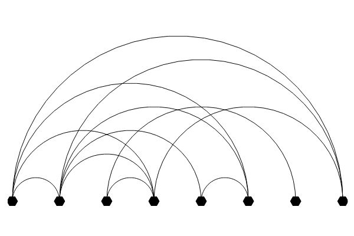
      
Source:&nbsp;&nbsp; <a href=""><strike>Python</strike></a> &nbsp;&nbsp; <a href="src/arc-diagrams/arc.R">R</a> &nbsp;&nbsp; <a href="src/arc-diagrams/arc.jl">Julia</a> 

    </td>
    <td class="tg-0pky">
      <h4>Bands</h4>
      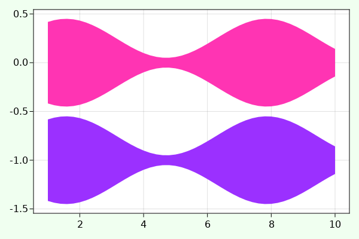
      
Source:&nbsp;&nbsp; <a href=""><strike>Python</strike></a> &nbsp;&nbsp; <a href="">R</a> &nbsp;&nbsp; <a href="src/bands/bands.jl">Julia</a> 

    </td>
    <td class="tg-0pky">
      <h4>Chord diagram</h4>
      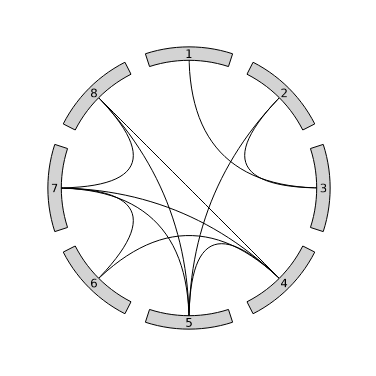
      
Source:&nbsp;&nbsp; <a href="">Python</a> &nbsp;&nbsp; <a href="">R</a> &nbsp;&nbsp; <a href="src/chord-diagrams/chords.jl">Julia</a> 

    </td>                                                                                                                         
   <td class="tg-0pky">
      <h4>Dendrogram</h4>
      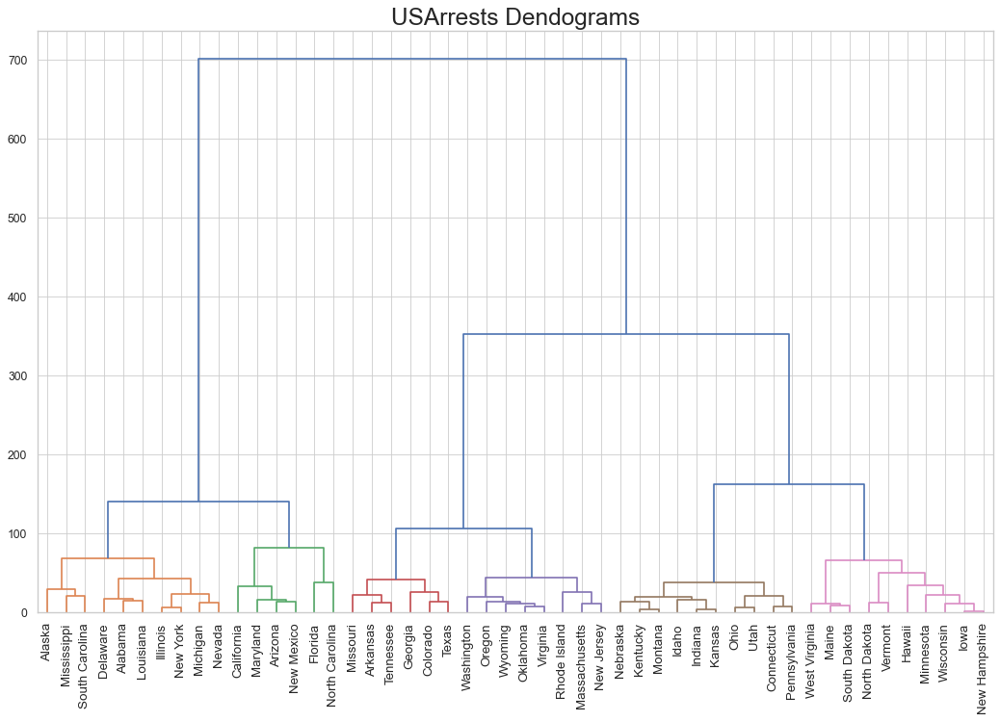
       
Source:&nbsp;&nbsp; <a href="">Python</a> &nbsp;&nbsp; <a href=""><strike>R</strike></a> &nbsp;&nbsp; <a href="src/chord-diagrams/chords.jl"><strike>Julia</strike></a> 

    </td>                                                                                                                           
  </tr>
  <tr>
    <td class="tg-0pky">
      <h4>Decision Tree</h4>
      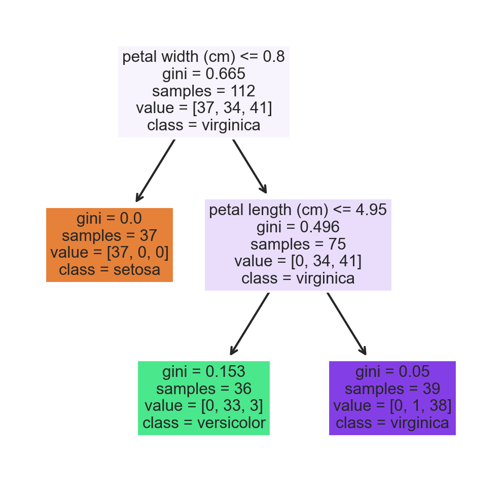
       
Source:&nbsp;&nbsp; <a href="src/decision-trees/decision_tree.py">Python</a> &nbsp;&nbsp; <a href="">R</a> &nbsp;&nbsp; <a href=""><strike>Julia</strike></a> 

    </td>                                                                                                                        
    <td class="tg-0pky">
          <h4>Dumbell chart</h4>
          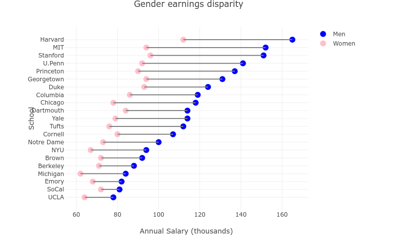
                                                                                                  
Source:&nbsp;&nbsp; <a href="src/dumbellcharts/dumbell.py">Python</a> &nbsp;&nbsp; <a href=""><strike>R</strike></a> &nbsp;&nbsp; <a href="src/dumbellcharts/dumbell.jl">Julia</a> 
               </td>                                                                                                                      
    <td class="tg-0pky">
           <h4>EEG</h4>
          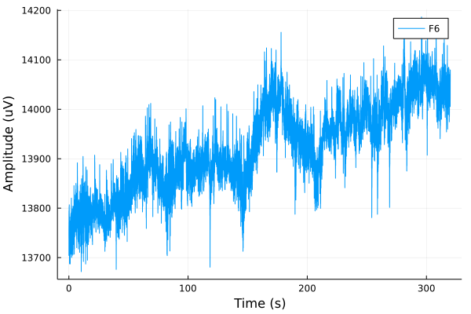
          
Source:&nbsp;&nbsp; <a href="src/eeg/mri_eeg.py">Python</a> &nbsp;&nbsp; <a href=""><strike>R</strike></a> &nbsp;&nbsp; <a href="src/eeg/single_channel_eeg.jl">Julia</a> 
 
    </td>                                                                                                                         
    <td class="tg-0pky">
           <h4>Fan chart</h4>
          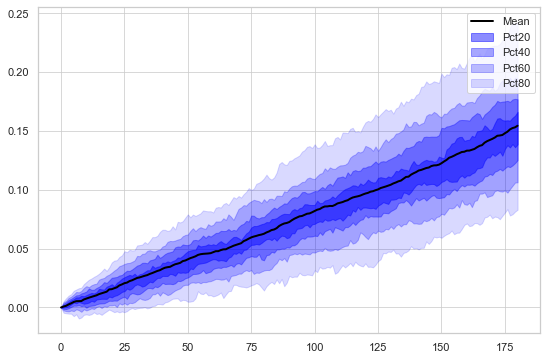
          
Source:&nbsp;&nbsp; <a href="src/fancharts/fanchart.py">Python</a> &nbsp;&nbsp; <a href=""><strike>R</strike></a> &nbsp;&nbsp; <a href=""><strike>Julia</strike></a> 
 
    </td>
  </tr>
  <tr>
    <td class="tg-0pky">
       <h4>BOE Fan chart</h4>
       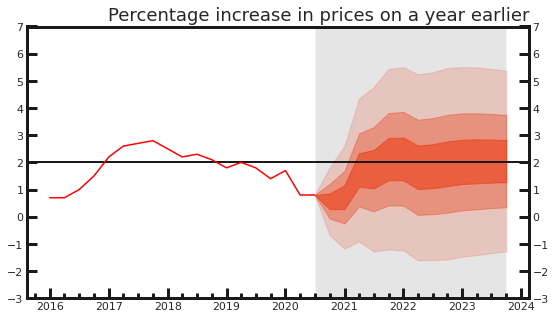
                
Source:&nbsp;&nbsp; <a href="src/fancharts/boe_fanchart.py">Python</a> &nbsp;&nbsp; <a href=""><strike>R</strike></a> &nbsp;&nbsp; <a href=""><strike>Julia</strike></a> 
 
    </td>
    <td class="tg-0pky">
       <h4>Line Types</h4>
       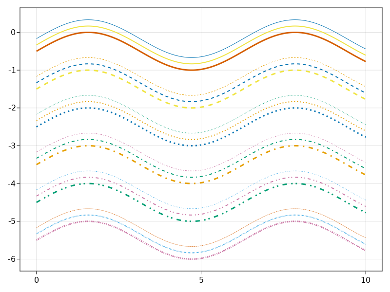
                                                                                                   
Source:&nbsp;&nbsp; <a href=""><strike>Python</strike></a> &nbsp;&nbsp; <a href=""><strike>R</strike></a> &nbsp;&nbsp; <a href="src/lines/linetypes.jl">Julia</a> 
 
    </td>
    <td class="tg-0pky">
       <h4>Line Plot</h4>
       
                                                                                                   
Source:&nbsp;&nbsp; <a href=""><strike>Python</strike></a> &nbsp;&nbsp; <a href="src/lines/lines.R">R</a> &nbsp;&nbsp; <a href="src/lines/lineplots.jl">Julia</a> 
 
    </td>
    <td class="tg-0pky">
       <h4>Line Plot Subplots</h4>
       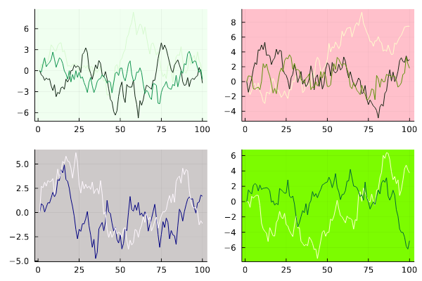
                                                                                                   
Source:&nbsp;&nbsp; <a href=""><strike>Python</strike></a> &nbsp;&nbsp; <a href=""><strike>R</strike></a> &nbsp;&nbsp; <a href="src/lines/lineplots.jl">Julia</a> 
 
    </td>
  </tr>
  <tr>
    </td>
    <td class="tg-0pky">
       <h4>Graph Network</h4>
       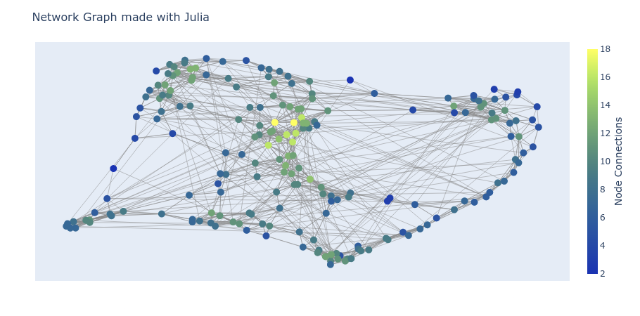
                                                                                                   
Source:&nbsp;&nbsp; <a href="src/networks/networks.py">Python</a> &nbsp;&nbsp; <a href=""><strike>R</strike></a> &nbsp;&nbsp; <a href="src/networks/networks.jl">Julia</a> 
 
    </td>
    <td class="tg-0pky">
       <h4>PhyloTree</h4>
       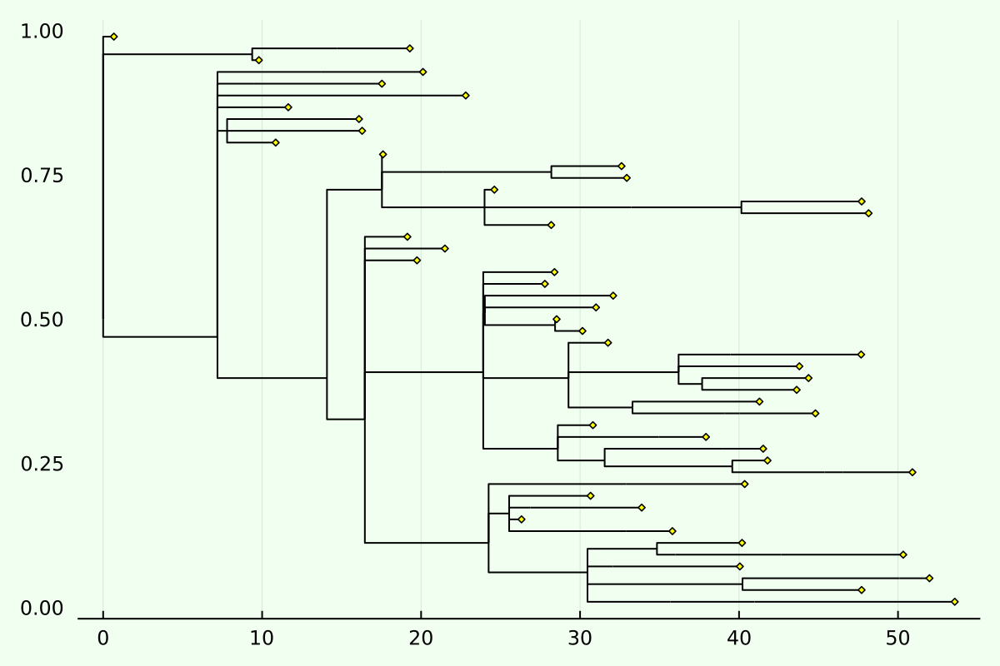
                                                                                                   
Source:&nbsp;&nbsp; <a href=""><strike>Python</strike></a> &nbsp;&nbsp; <a href=""><strike>R</strike></a> &nbsp;&nbsp; <a href="src/phylotrees/phylotree.jl">Julia</a> 
 
    </td>
       <td class="tg-0pky">
       <h4>Range bars</h4>
       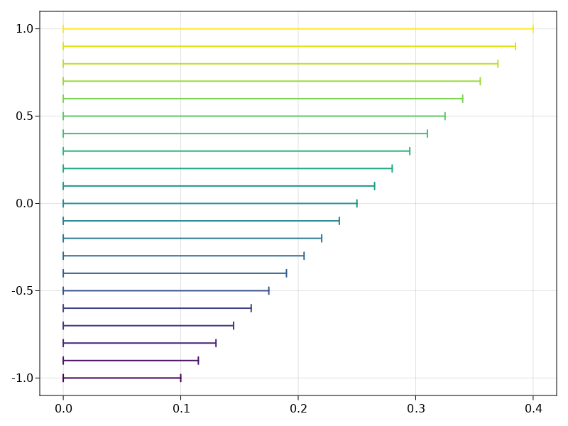
                                                                                                   
Source:&nbsp;&nbsp; <a href=""><strike>Python</strike></a> &nbsp;&nbsp; <a href=""><strike>R</strike></a> &nbsp;&nbsp; <a href="src/rangebars/rangebars.jl">Julia</a> 
 
    </td>
    <td class="tg-0pky">
       <h4>Sankey Chart</h4>
       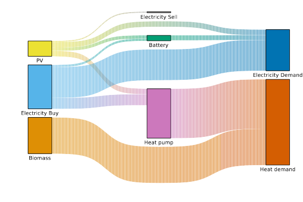
                                                                                                   
Source:&nbsp;&nbsp; <a href="src/sankey-diagrams/sankey.py">Python</a> &nbsp;&nbsp; <a href=""><strike>R</strike></a> &nbsp;&nbsp; <a href="src/sankey-diagrams/sankey.jl">Julia</a> 
 
    </td>
    </td>
  </tr>
  <tr>
  <td class="tg-0pky">
       <h4>Matrix Series</h4>
       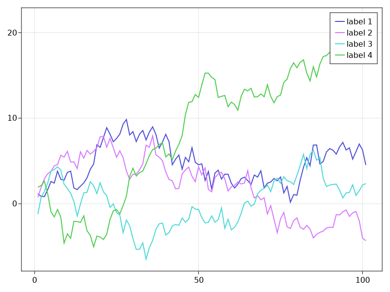
                                                                                                   
Source:&nbsp;&nbsp; <a href=""><strike>Python</strike></a> &nbsp;&nbsp; <a href=""><strike>R</strike></a> &nbsp;&nbsp; <a href="src/series/matrix.jl">Julia</a> 
 
    </td>
    <td class="tg-0pky">
       <h4>Vector of Vector Series</h4>
       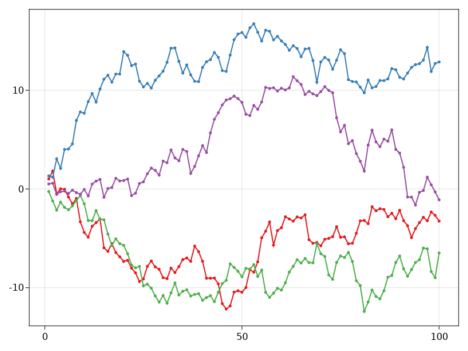
                                                                                                   
Source:&nbsp;&nbsp; <a href=""><strike>Python</strike></a> &nbsp;&nbsp; <a href=""><strike>R</strike></a> &nbsp;&nbsp; <a href="src/series/vecofvec.jl">Julia</a> 
 
    </td>
    <td class="tg-0pky">
       <h4>Slope chart</h4>
       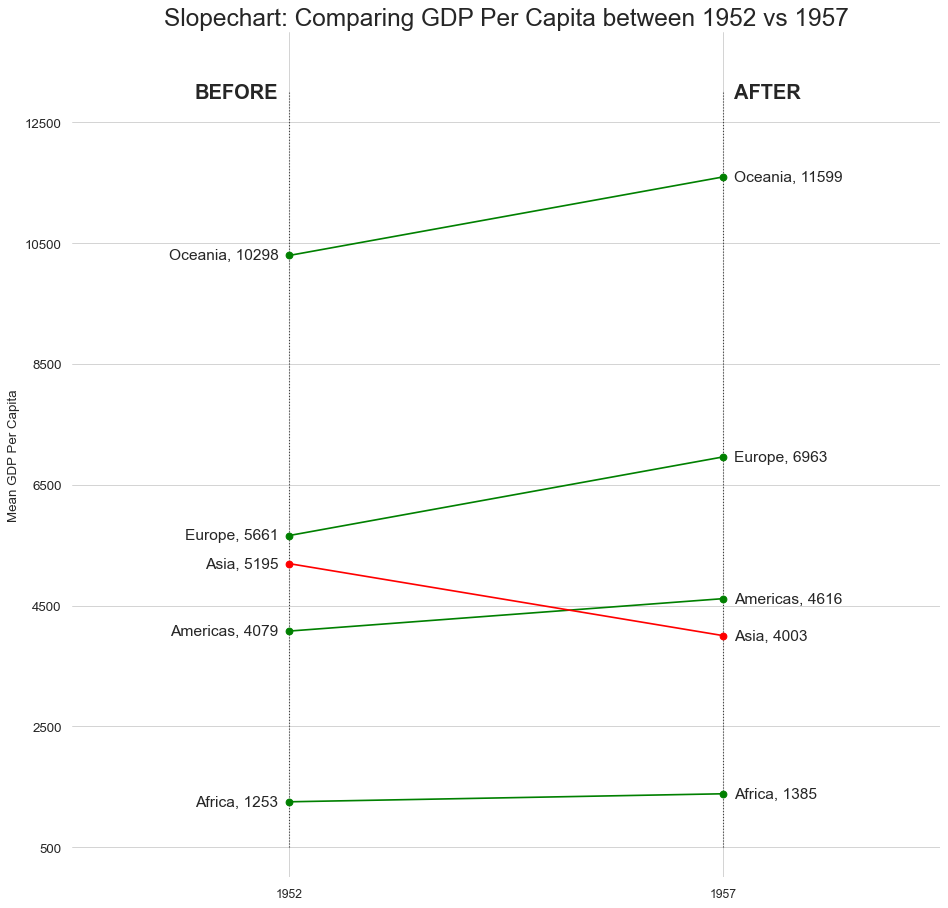
                                                                                                   
Source:&nbsp;&nbsp; <a href="src/slopecharts/slopechart.py">Python</a> &nbsp;&nbsp; <a href="src/slopecharts/slopegraph.R">R</a> &nbsp;&nbsp; <a href=""><strike>Julia</strike></a> 
 
    </td>
    <td class="tg-0pky">
       <h4>Streamgraph</h4>
       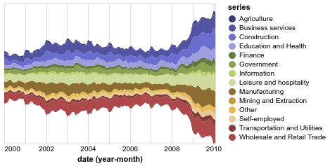
                                                                                                   
Source:&nbsp;&nbsp; <a href="src/streamgraph/streamgraphs.py">Python</a> &nbsp;&nbsp; <a href="src/streamgraph/streamgraphs.R">R</a> &nbsp;&nbsp; <a href="src/streamgraph/streamgraphs.jl">Julia</a> 
 
    </td>
  </tr>
  <tr>
   <td class="tg-0pky">
       <h4>Streamplot</h4>
       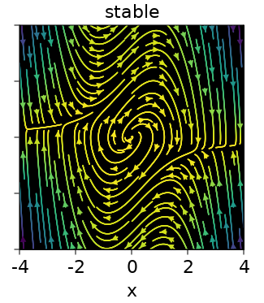
                                                                                                   
Source:&nbsp;&nbsp; <a href=""><strike>Python</strike></a> &nbsp;&nbsp; <a href=""><strike>R</strike></a> &nbsp;&nbsp; <a href="src/streamplots/streamplots.jl">Julia</a> 
 
    </td>
   <td class="tg-0pky">
       <h4>Abstract Tree</h4>
       
                                                                                                   
Source:&nbsp;&nbsp; <a href=""><strike>Python</strike></a> &nbsp;&nbsp; <a href=""><strike>R</strike></a> &nbsp;&nbsp; <a href="src/trees/trees.jl">Julia</a> 
 
    </td>
    <td class="tg-0pky">
       <h4>AS Tree</h4>
       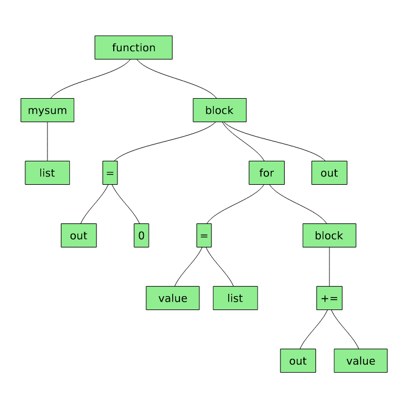
                                                                                                   
Source:&nbsp;&nbsp; <a href=""><strike>Python</strike></a> &nbsp;&nbsp; <a href=""><strike>R</strike></a> &nbsp;&nbsp; <a href="src/trees/trees.jl">Julia</a> 
 
    </td>
    <td class="tg-0pky">
       <h4>Parallel Coordinates</h4>
       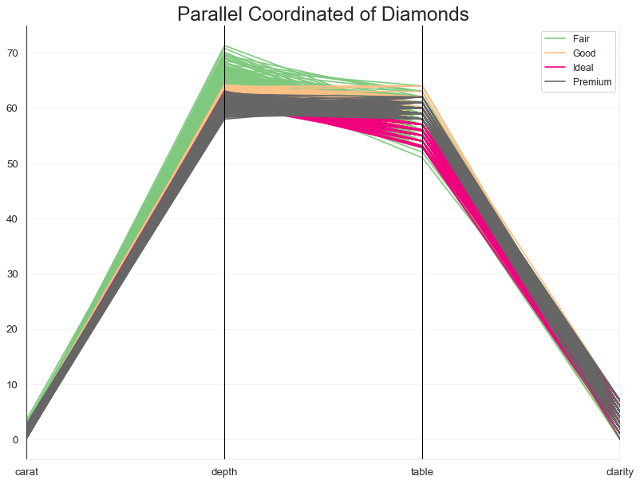
                                                                                                   
Source:&nbsp;&nbsp; <a href="src/lines/parallel_coord.py">Python</a> &nbsp;&nbsp; <a href=""><strike>R</strike></a> &nbsp;&nbsp; <a href="src/lines/parallel_coord.jl">Julia</a> 
 
    </td>
  </tr>
  </tbody>
</table> 
 
<table class="tg">
<thead>
  <tr>
    <h2>Curves and Functions</h2>
  </tr>
</thead>
<tbody>
  <tr>
    <td class="tg-0pky">
       <h4>B Spline</h4>
       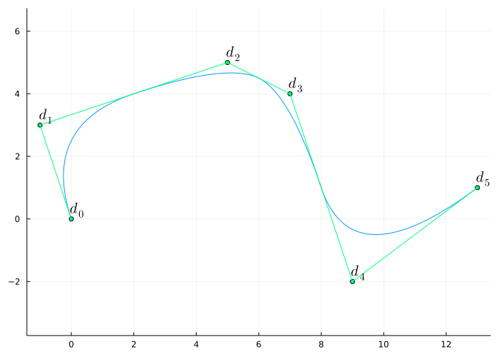
                                                                                                   
Source:&nbsp;&nbsp; <a href=""><strike>Python</strike></a> &nbsp;&nbsp; <a href=""><strike>R</strike></a> &nbsp;&nbsp; <a href="src/lines/b_spline.jl">Julia</a> 
 
    </td>
     <td class="tg-0pky">
       <h4>Bernstein's basis</h4>
       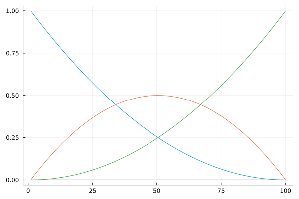
                                                                                                   
Source:&nbsp;&nbsp; <a href=""><strike>Python</strike></a> &nbsp;&nbsp; <a href=""><strike>R</strike></a> &nbsp;&nbsp; <a href="src/lines/bernstein.jl">Julia</a> 
 
    </td>
    <td class="tg-0pky">
       <h4>Batman's Heaviside</h4>
       
                                                                                                   
Source:&nbsp;&nbsp; <a href=""><strike>Python</strike></a> &nbsp;&nbsp; <a href=""><strike>R</strike></a> &nbsp;&nbsp; <a href="src/lines/batman_curve.jl">Julia</a> 
 
    </td>
     <td class="tg-0pky">
       <h4>Spherical Bessel Function</h4>
       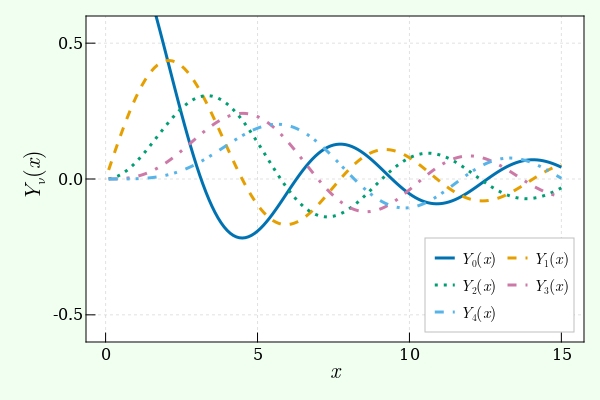
                                                                                                   
Source:&nbsp;&nbsp; <a href=""><strike>Python</strike></a> &nbsp;&nbsp; <a href=""><strike>R</strike></a> &nbsp;&nbsp; <a href="src/lines/bessel_fns.jl">Julia</a> 
 
    </td>
  </tr>
  <tr>
    <td class="tg-0pky">
       <h4>Cos θ Sin θ Curves</h4>
       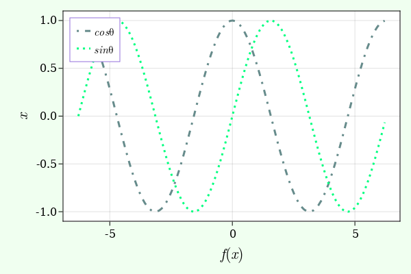
                                                                                                   
Source:&nbsp;&nbsp; <a href=""><strike>Python</strike></a> &nbsp;&nbsp; <a href=""><strike>R</strike></a> &nbsp;&nbsp; <a href="src/lines/cos_sin_curves.jl">Julia</a> 
 
    </td>
     <td class="tg-0pky">
       <h4>Fourier Series</h4>
       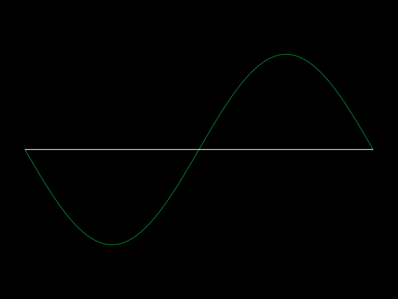
                                                                                                   
Source:&nbsp;&nbsp; <a href=""><strike>Python</strike></a> &nbsp;&nbsp; <a href=""><strike>R</strike></a> &nbsp;&nbsp; <a href="src/fourier/fourier_series.jl">Julia</a> 
 
    </td>
    <td class="tg-0pky">
       <h4>Epicycloid</h4>
       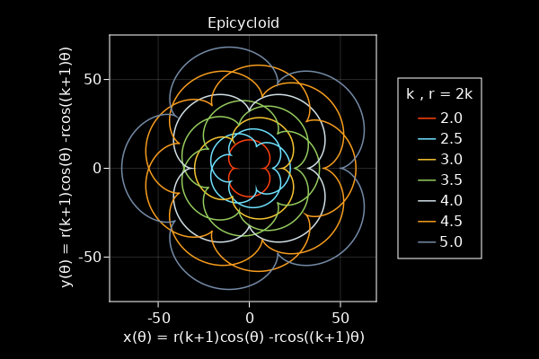
                                                                                                   
Source:&nbsp;&nbsp; <a href=""><strike>Python</strike></a> &nbsp;&nbsp; <a href=""><strike>R</strike></a> &nbsp;&nbsp; <a href="src/epicycloid/epicycloid.jl">Julia</a> 
 
    </td>
     <td class="tg-0pky">
       <h4>ECDF</h4>
       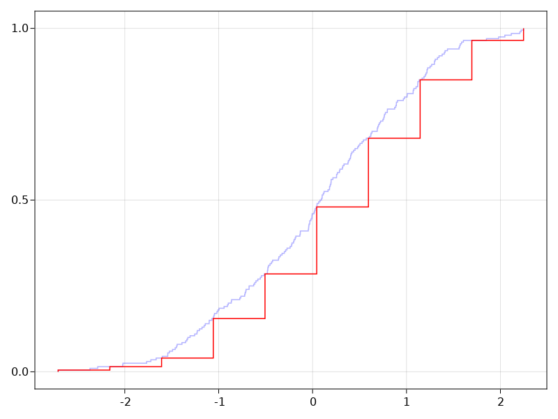
                                                                                                   
Source:&nbsp;&nbsp; <a href=""><strike>Python</strike></a> &nbsp;&nbsp; <a href=""><strike>R</strike></a> &nbsp;&nbsp; <a href="src/lines/ecdf.jl">Julia</a> 
 
    </td>
  </tr>
  <tr>
   <td class="tg-0pky">
       <h4>Bezier Curve</h4>
       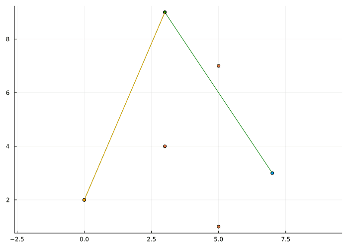
                                                                                                   
Source:&nbsp;&nbsp; <a href="src/lines/bezier.py">Python</a> &nbsp;&nbsp; <a href=""><strike>R</strike></a> &nbsp;&nbsp; <a href=" src/lines/bezier.jl">Julia</a> 
 
    </td>
    <td class="tg-0pky">
       <h4>Bessel Y Function</h4>
       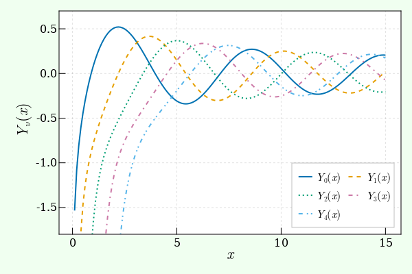
                                                                                                   
Source:&nbsp;&nbsp; <a href=""><strike>Python</strike></a> &nbsp;&nbsp; <a href=""><strike>R</strike></a> &nbsp;&nbsp; <a href="src/lines/bessel_fns.jl">Julia</a> 
 
    </td>
    <td class="tg-0pky">
       <h4>Exponential Curve</h4>
       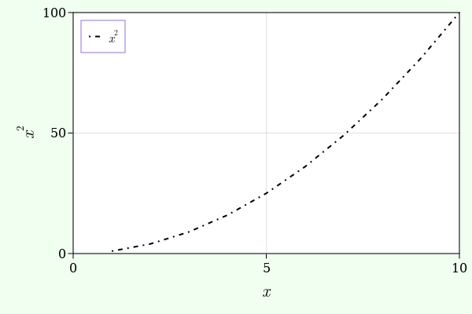
                                                                                                   
Source:&nbsp;&nbsp; <a href=""><strike>Python</strike></a> &nbsp;&nbsp; <a href=""><strike>R</strike></a> &nbsp;&nbsp; <a href="src/lines/exp_curve.jl">Julia</a> 
 
    </td>
    <td class="tg-0pky">
       <h4>Fibonacci Sequence</h4>
       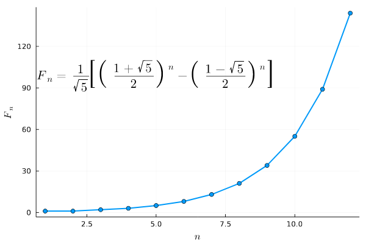
                                                                                                   
Source:&nbsp;&nbsp; <a href=""><strike>Python</strike></a> &nbsp;&nbsp; <a href=""><strike>R</strike></a> &nbsp;&nbsp; <a href="src/lines/fibonacci.jl">Julia</a> 
 
    </td>
  </tr>
  <tr>
    <td class="tg-0pky">
       <h4>Line inset heatmap</h4>
       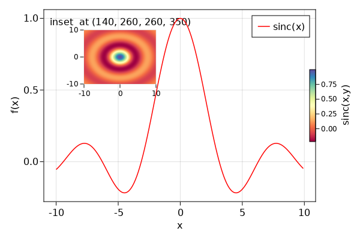
                                                                                                   
Source:&nbsp;&nbsp; <a href=""><strike>Python</strike></a> &nbsp;&nbsp; <a href=""><strike>R</strike></a> &nbsp;&nbsp; <a href="src/lines/line_inset_hm.jl">Julia</a> 
 
    </td>
    <td class="tg-0pky">
       <h4>Log Beta</h4>
       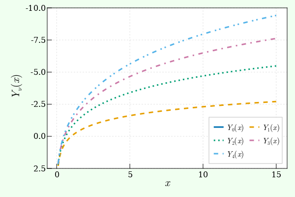
                                                                                                   
Source:&nbsp;&nbsp; <a href=""><strike>Python</strike></a> &nbsp;&nbsp; <a href=""><strike>R</strike></a> &nbsp;&nbsp; <a href="src/lines/logbeta.jl">Julia</a> 
 
    </td>
    <td class="tg-0pky">
       <h4>DWD Margin Loss</h4>
       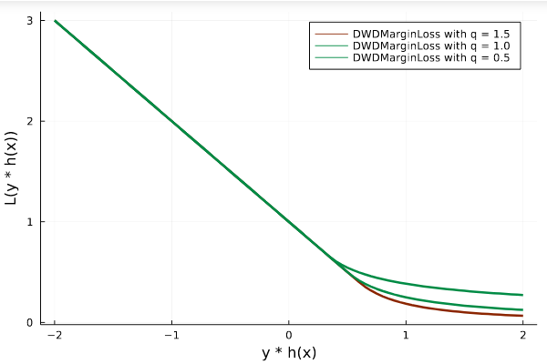
                                                                                                   
Source:&nbsp;&nbsp; <a href=""><strike>Python</strike></a> &nbsp;&nbsp; <a href=""><strike>R</strike></a> &nbsp;&nbsp; <a href="src/lines/loss-curves/dwd_margin.jl">Julia</a> 
 
    </td>
    <td class="tg-0pky">
       <h4>Exponential Loss</h4>
       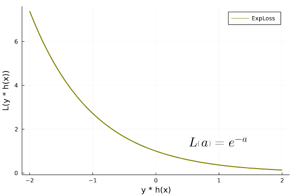
                                                                                                   
Source:&nbsp;&nbsp; <a href=""><strike>Python</strike></a> &nbsp;&nbsp; <a href=""><strike>R</strike></a> &nbsp;&nbsp; <a href="src/lines/loss-curves/exp.jl">Julia</a> 
 
    </td>
  </tr>
  <tr>
    <td class="tg-0pky">
       <h4>Huber Loss</h4>
       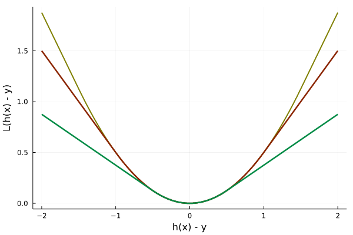
                                                                                                   
Source:&nbsp;&nbsp; <a href=""><strike>Python</strike></a> &nbsp;&nbsp; <a href=""><strike>R</strike></a> &nbsp;&nbsp; <a href="src/lines/loss-curves/huber.jl">Julia</a> 
 
    </td>
     <td class="tg-0pky">
       <h4>Modified Huber Loss</h4>
       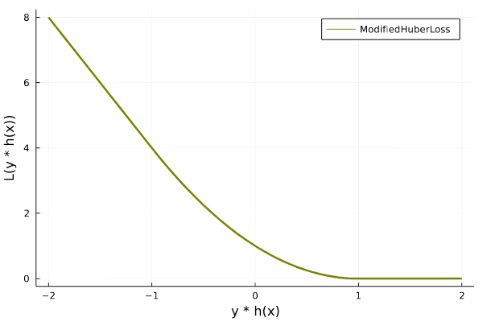
                                                                                                   
Source:&nbsp;&nbsp; <a href=""><strike>Python</strike></a> &nbsp;&nbsp; <a href=""><strike>R</strike></a> &nbsp;&nbsp; <a href="src/lines/loss-curves/mod_huber.jl">Julia</a> 
 
    </td>
     <td class="tg-0pky">
       <h4>L1DistLoss</h4>
       
                                                                                                   
Source:&nbsp;&nbsp; <a href=""><strike>Python</strike></a> &nbsp;&nbsp; <a href=""><strike>R</strike></a> &nbsp;&nbsp; <a href="src/lines/loss-curves/l1_dist.jl">Julia</a> 
 
    </td>
     <td class="tg-0pky">
       <h4>L2DistLoss</h4>
       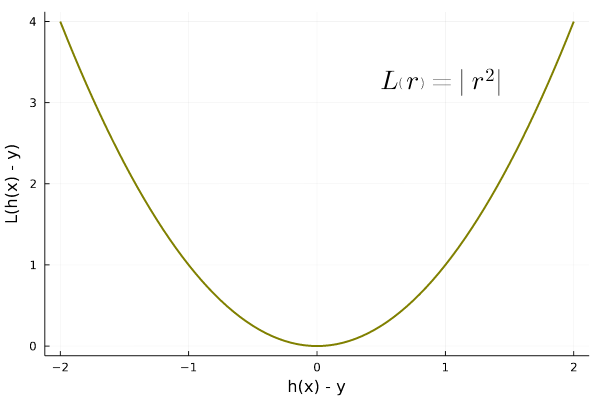
                                                                                                   
Source:&nbsp;&nbsp; <a href=""><strike>Python</strike></a> &nbsp;&nbsp; <a href=""><strike>R</strike></a> &nbsp;&nbsp; <a href="src/lines/loss-curves/l2_dist.jl">Julia</a> 
 
    </td>
  </tr>
  <tr>
     <td class="tg-0pky">
       <h4>L1EpsilonInsLoss</h4>
       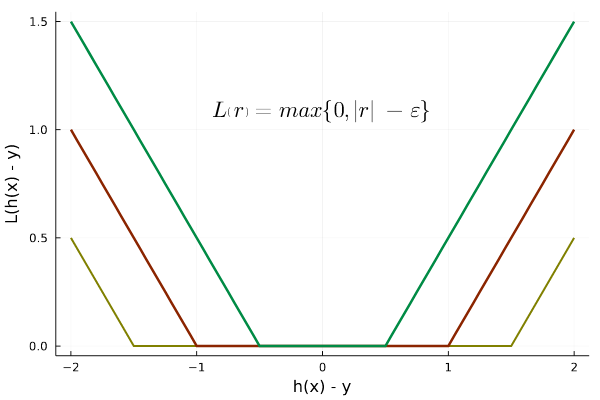
                                                                                                   
Source:&nbsp;&nbsp; <a href=""><strike>Python</strike></a> &nbsp;&nbsp; <a href=""><strike>R</strike></a> &nbsp;&nbsp; <a href="src/lines/loss-curves/l1_epsilon.jl">Julia</a> 
 
    </td>
     <td class="tg-0pky">
       <h4>L2EpsilonInsLoss</h4>
       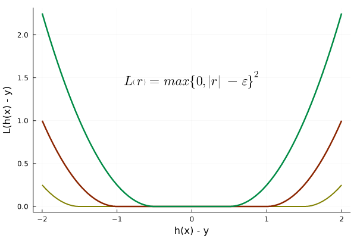
                                                                                                   
Source:&nbsp;&nbsp; <a href=""><strike>Python</strike></a> &nbsp;&nbsp; <a href=""><strike>R</strike></a> &nbsp;&nbsp; <a href="src/lines/loss-curves/l2_epsilon.jl">Julia</a> 
 
    </td>
     <td class="tg-0pky">
       <h4>L1HingeLoss</h4>
       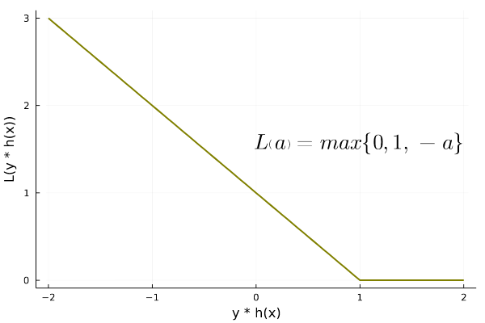
                                                                                                   
Source:&nbsp;&nbsp; <a href=""><strike>Python</strike></a> &nbsp;&nbsp; <a href=""><strike>R</strike></a> &nbsp;&nbsp; <a href="src/lines/loss-curves/l1_hinge.jl">Julia</a> 
 
    </td>
     <td class="tg-0pky">
       <h4>L2HingeLoss</h4>
       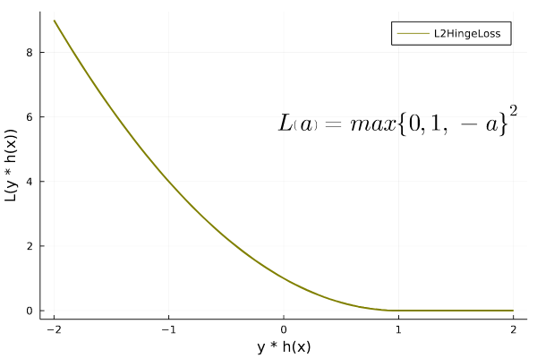
                                                                                                   
Source:&nbsp;&nbsp; <a href=""><strike>Python</strike></a> &nbsp;&nbsp; <a href=""><strike>R</strike></a> &nbsp;&nbsp; <a href="src/lines/loss-curves/l2_hinge.jl">Julia</a> 
 
    </td>
  </tr>
  <tr>
    <td class="tg-0pky">
       <h4>L2MarginLoss</h4>
       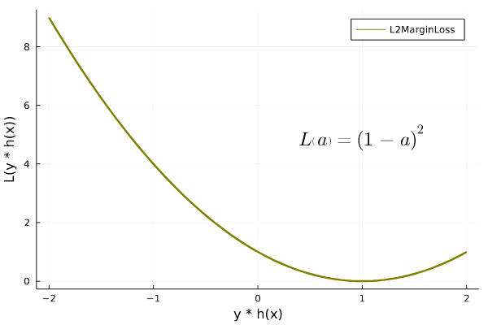
                                                                                                   
Source:&nbsp;&nbsp; <a href=""><strike>Python</strike></a> &nbsp;&nbsp; <a href=""><strike>R</strike></a> &nbsp;&nbsp; <a href="src/lines/loss-curves/l2_margin.jl">Julia</a> 
 
    </td>
    <td class="tg-0pky">
       <h4>LogitDistLoss</h4>
       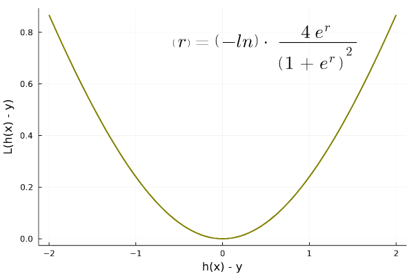
                                                                                                   
Source:&nbsp;&nbsp; <a href=""><strike>Python</strike></a> &nbsp;&nbsp; <a href=""><strike>R</strike></a> &nbsp;&nbsp; <a href="src/lines/loss-curves/logit_dist.jl">Julia</a> 
 
    </td>
    <td class="tg-0pky">
       <h4>LogitMarginLoss</h4>
       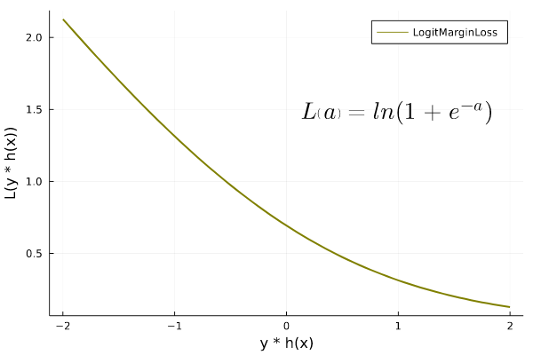
                                                                                                   
Source:&nbsp;&nbsp; <a href=""><strike>Python</strike></a> &nbsp;&nbsp; <a href=""><strike>R</strike></a> &nbsp;&nbsp; <a href="src/lines/loss-curves/logit_margin.jl">Julia</a> 
 
    </td>
    <td class="tg-0pky">
       <h4>PerceptronLoss</h4>
       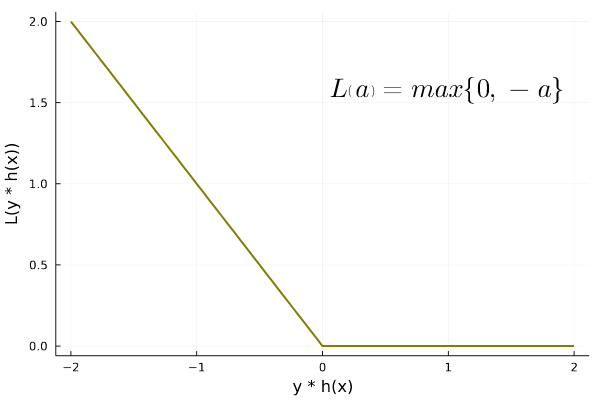
                                                                                                   
Source:&nbsp;&nbsp; <a href=""><strike>Python</strike></a> &nbsp;&nbsp; <a href=""><strike>R</strike></a> &nbsp;&nbsp; <a href="src/lines/loss-curves/perceptron.jl">Julia</a> 
 
    </td>
  </tr>
  <tr>
    <td class="tg-0pky">
       <h4>PeriodicLoss</h4>
       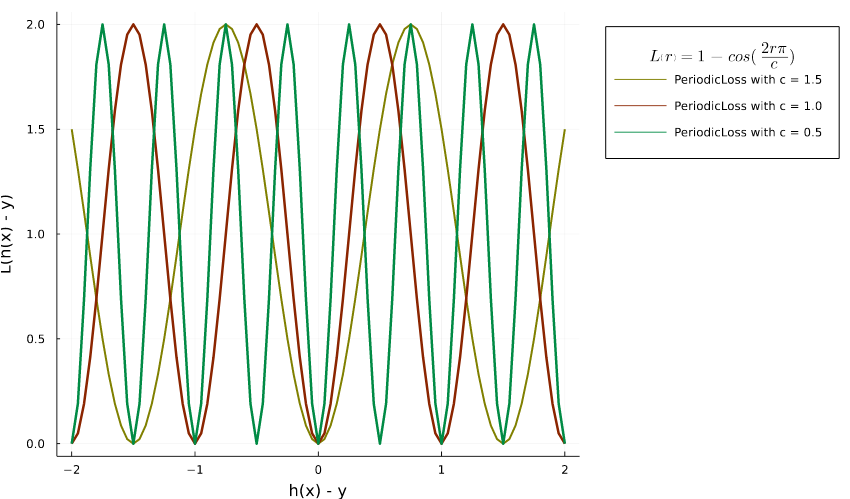
                                                                                                   
Source:&nbsp;&nbsp; <a href=""><strike>Python</strike></a> &nbsp;&nbsp; <a href=""><strike>R</strike></a> &nbsp;&nbsp; <a href="src/lines/loss-curves/periodic.jl">Julia</a> 
 
    </td>
    <td class="tg-0pky">
       <h4>QuantileLoss</h4>
       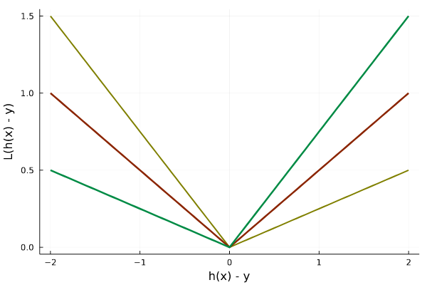
                                                                                                   
Source:&nbsp;&nbsp; <a href=""><strike>Python</strike></a> &nbsp;&nbsp; <a href=""><strike>R</strike></a> &nbsp;&nbsp; <a href="src/lines/loss-curves/quantile.jl">Julia</a> 
 
    </td>
    <td class="tg-0pky">
       <h4>SigmoidLoss</h4>
       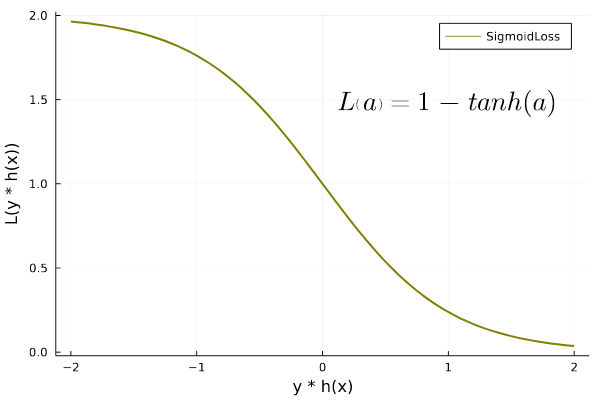
                                                                                                   
Source:&nbsp;&nbsp; <a href=""><strike>Python</strike></a> &nbsp;&nbsp; <a href=""><strike>R</strike></a> &nbsp;&nbsp; <a href="src/lines/loss-curves/sigmoid.jl">Julia</a> 
 
    </td>
    <td class="tg-0pky">
       <h4>ZeroOneLoss</h4>
       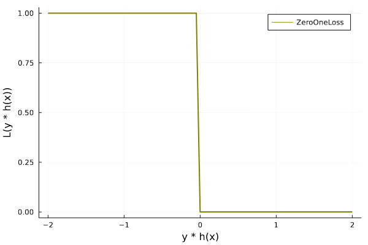
                                                                                                   
Source:&nbsp;&nbsp; <a href=""><strike>Python</strike></a> &nbsp;&nbsp; <a href=""><strike>R</strike></a> &nbsp;&nbsp; <a href="src/lines/loss-curves/zeroone.jl">Julia</a> 
 
    </td>
  </tr>
  <tr>
    <td class="tg-0pky">
       <h4>Smoothed L1HingeLoss</h4>
       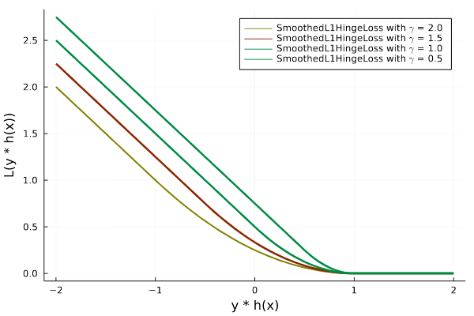
                                                                                                   
Source:&nbsp;&nbsp; <a href=""><strike>Python</strike></a> &nbsp;&nbsp; <a href=""><strike>R</strike></a> &nbsp;&nbsp; <a href="src/lines/loss-curves/l1_hinge.jl">Julia</a> 
 
    </td>
    <td class="tg-0pky">
       <h4>Series curves</h4>
       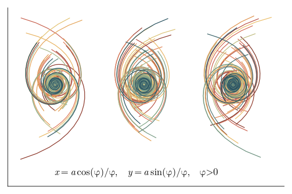
                                                                                                   
Source:&nbsp;&nbsp; <a href=""><strike>Python</strike></a> &nbsp;&nbsp; <a href=""><strike>R</strike></a> &nbsp;&nbsp; <a href="src/series/series.jl">Julia</a> 
 
    </td>
    <td class="tg-0pky">
       <h4>Random Polynomial 1</h4>
       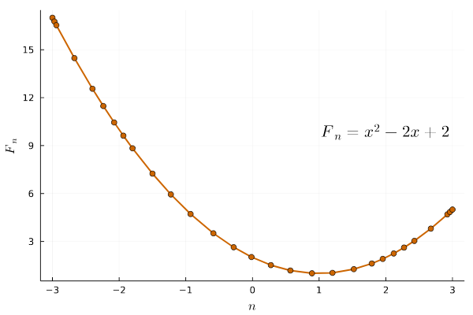
                                                                                                   
Source:&nbsp;&nbsp; <a href=""><strike>Python</strike></a> &nbsp;&nbsp; <a href=""><strike>R</strike></a> &nbsp;&nbsp; <a href="src/lines/loss-curves/polynomials.jl">Julia</a> 
 
    </td>
  </tr>
</tbody>
</table> 
 
<table class="tg">
<thead>
  <tr>
    <h2>Scatters and Correlation</h2>
  </tr>
</thead>
<tbody>
  <tr>
    <td class="tg-0pky">
       <h4>Heatmap</h4>
       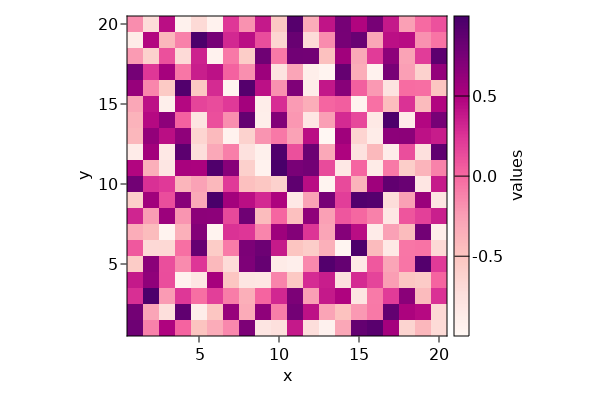
                                                                                                   
Source:&nbsp;&nbsp; <a href="src/heatmaps/heatmaps.py">Python</a> &nbsp;&nbsp; <a href="src/heatmaps/heatmap.R">R</a> &nbsp;&nbsp; <a href="src/heatmaps/heatmap.jl">Julia</a> 
 
    </td>
     <td class="tg-0pky">
       <h4>Annotated Heatmap</h4>
       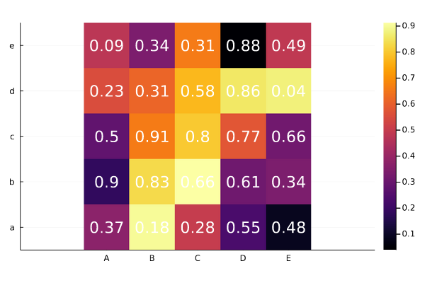
                                                                                                   
Source:&nbsp;&nbsp; <a href=""><strike>Python</strike></a> &nbsp;&nbsp; <a href=""><strike>R</strike></a> &nbsp;&nbsp; <a href="src/heatmaps/heatmap.jl">Julia</a> 
 
    </td>
    <td class="tg-0pky">
       <h4>Calendar Heatmap</h4>
       
                                                                                                   
Source:&nbsp;&nbsp; <a href="src/heatmaps/calheatmaps.py">Python</a> &nbsp;&nbsp; <a href="src/heatmaps/calheatmaps.R">R</a> &nbsp;&nbsp; <a href="src/heatmaps/calheatmaps.jl">Julia</a> 
 
    </td>
     <td class="tg-0pky">
       <h4>Hextiles</h4>
       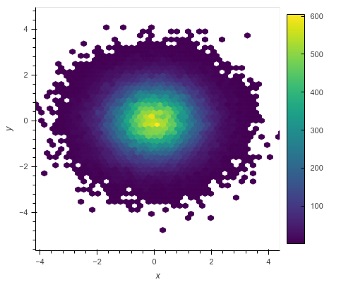
                                                                                                   
Source:&nbsp;&nbsp; <a href="src/hextiles/hextiles.py">Python</a> &nbsp;&nbsp; <a href=""><strike>R</strike></a> &nbsp;&nbsp; <a href=""><strike>Julia</strike></a> 
 
    </td>
  </tr>
  <tr>
   <td class="tg-0pky">
       <h4>Stem Plot</h4>
       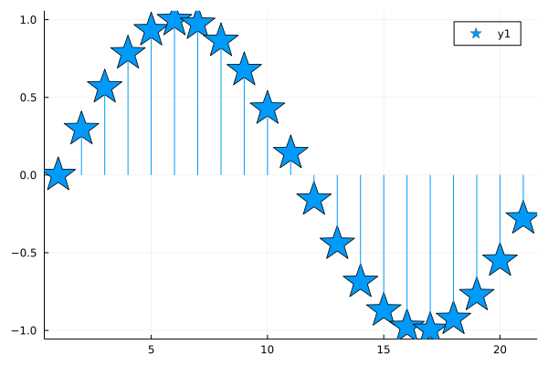
                                                                                                   
Source:&nbsp;&nbsp; <a href="src/stemplots/stem.py">Python</a> &nbsp;&nbsp; <a href=""><strike>R</strike></a> &nbsp;&nbsp; <a href="src/stemplots/stem.jl">Julia</a> 
 
    </td>
    <td class="tg-0pky">
       <h4>Mariemekko/Mosaic</h4>
       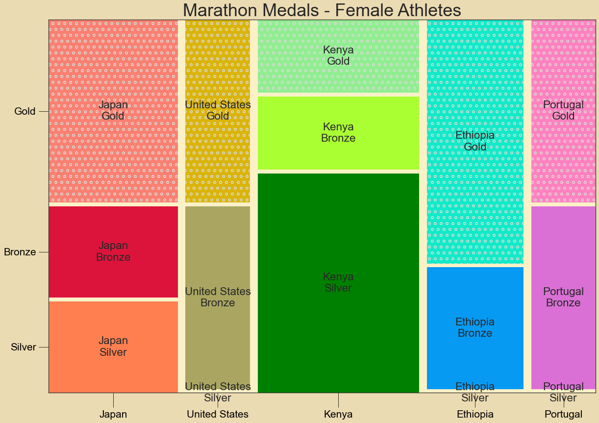
                                                                                                   
Source:&nbsp;&nbsp; <a href="src/mosaic/marimekko.py">Python</a> &nbsp;&nbsp; <a href="src/mosaic/marimekko.R">R</a> &nbsp;&nbsp; <a href=""><strike>Julia</strike></a> 
 
    </td>
    <td class="tg-0pky">
       <h4>Scatter Plot</h4>
       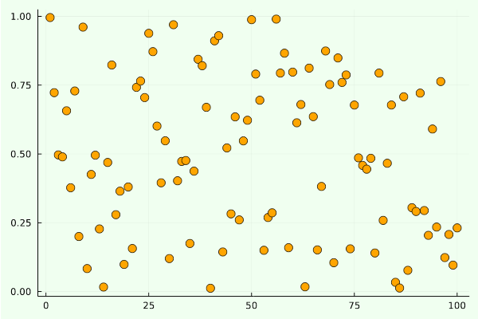
                                                                                                   
Source:&nbsp;&nbsp; <a href="src/scatter/scatterplot.py">Python</a> &nbsp;&nbsp; <a href="">R</a> &nbsp;&nbsp; <a href="src/scatter/scatterplot.jl">Julia</a> 
 
    </td>
    <td class="tg-0pky">
       <h4>Scatter Errorbars</h4>
       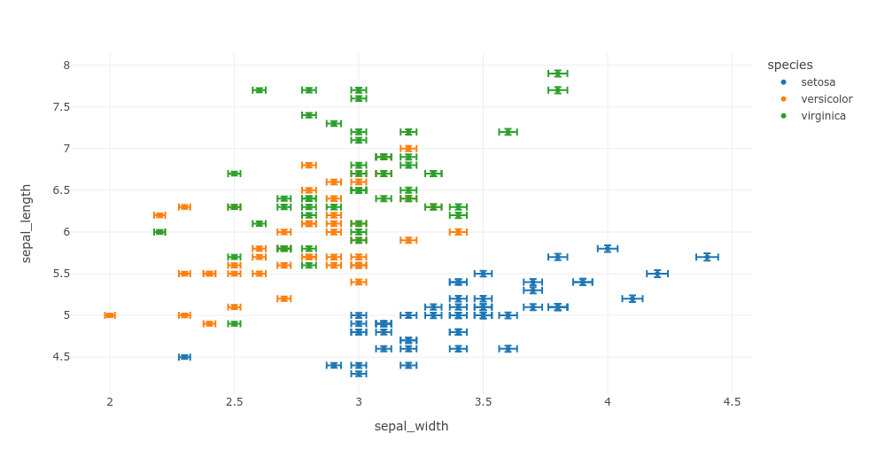
                                                                                                   
Source:&nbsp;&nbsp; <a href="src/scatter/scatter_errorbars.py">Python</a> &nbsp;&nbsp; <a href=""><strike>R</strike></a> &nbsp;&nbsp; <a href=""><strike>Julia</strike></a> 
 
    </td>
  </tr>
  <tr>
    <td class="tg-0pky">
       <h4>Scatter Markers</h4>
       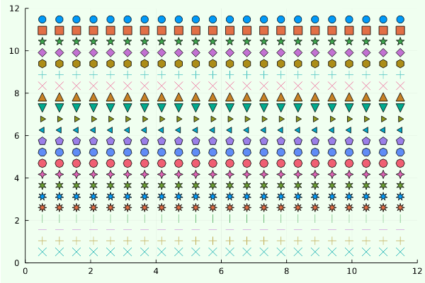
                                                                                                   
Source:&nbsp;&nbsp; <a href=""><strike>Python</strike></a> &nbsp;&nbsp; <a href=""><strike>R</strike></a> &nbsp;&nbsp; <a href="src/scatter/scattermarkers.jl">Julia</a> 
 
    </td>
    <td class="tg-0pky">
       <h4>Scatter lines</h4>
       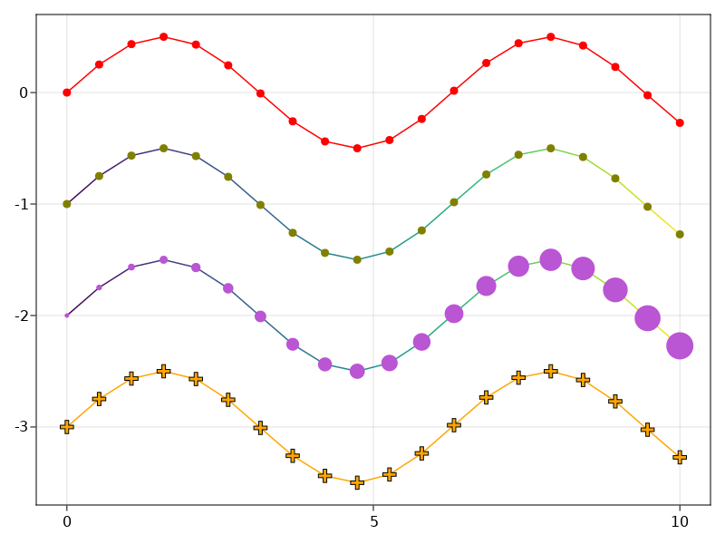
                                                                                                   
Source:&nbsp;&nbsp; <a href="src/scatter/scatterlines.py">Python</a> &nbsp;&nbsp; <a href=""><strike>R</strike></a> &nbsp;&nbsp; <a href="src/scatter/scatterlines.jl">Julia</a> 
 
    </td>
    <td class="tg-0pky">
       <h4>Tree map</h4>
       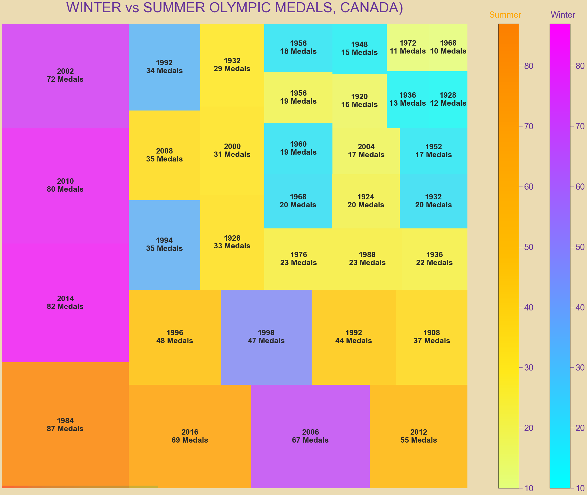
                                                                                                   
Source:&nbsp;&nbsp; <a href="src/treemap/treemap.py">Python</a> &nbsp;&nbsp; <a href="src/treemap/treemaps.R">R</a> &nbsp;&nbsp; <a href="src/treemap/treemaps.jl">Julia</a> 
 
    </td>
    <td class="tg-0pky">
       <h4>Wind barbs</h4>
       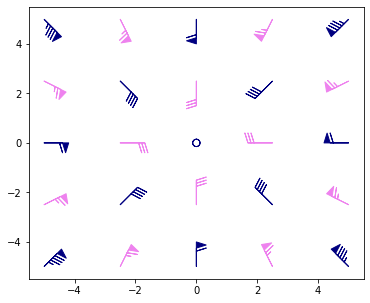
                                                                                                   
Source:&nbsp;&nbsp; <a href="src/wind-barbs/windbarbs.py">Python</a> &nbsp;&nbsp; <a href=""><strike>R</strike></a> &nbsp;&nbsp; <a href=""><strike>Julia</strike></a> 
 
    </td>
  </tr>
    <tr>
    <td class="tg-0pky">
       <h4>Bubble plot</h4>
       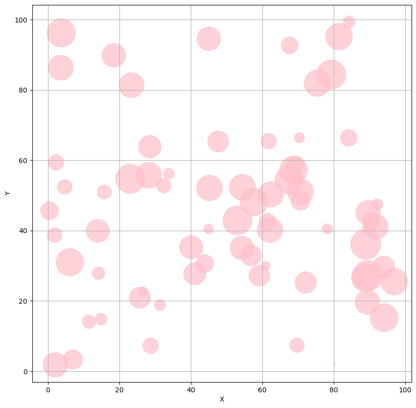
                                                                                                   
Source:&nbsp;&nbsp; <a href="src/bubbleplots/bubble.py">Python</a> &nbsp;&nbsp; <a href="src/bubbleplots/bubble.R">R</a> &nbsp;&nbsp; <a href="src/bubbleplots/bubble.jl">Julia</a> 
 
    </td>
    <td class="tg-0pky">
       <h4>Collatz Conjenture</h4>
       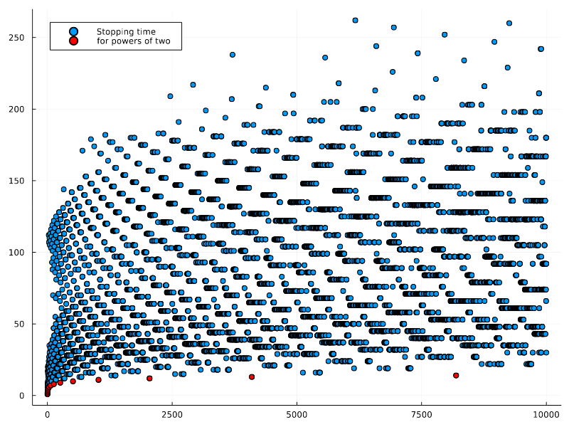
                                                                                                   
Source:&nbsp;&nbsp; <a href=""><strike>Python</strike></a> &nbsp;&nbsp; <a href=""><strike>R</strike></a> &nbsp;&nbsp; <a href="src/collatz-conjenture/collatz.jl">Julia</a> 
 
    </td>
    <td class="tg-0pky">
       <h4>Isotypes</h4>
       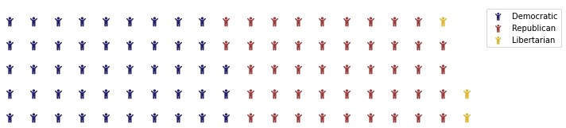
                                                                                                   
Source:&nbsp;&nbsp; <a href="src/isotypes/isotype.py">Python</a> &nbsp;&nbsp; <a href="">R</a> &nbsp;&nbsp; <a href=""><strike>Julia</strike></a> 
 
    </td>
    <td class="tg-0pky">
       <h4>Quiver</h4>
       
                                                                                                   
Source:&nbsp;&nbsp; <a href="src/quiver/quiver.py">Python</a> &nbsp;&nbsp; <a href=""><strike>R</strike></a> &nbsp;&nbsp; <a href="src/quiver/quiver.jl">Julia</a> 
 
    </td>
  </tr>
  <tr>
    <td class="tg-0pky">
       <h4>Heatmap + Dendrogram</h4>
       
                                                                                                   
Source:&nbsp;&nbsp; <a href=""><strike>Python</strike></a> &nbsp;&nbsp; <a href="src/heatmaps/heatmap.R">R</a> &nbsp;&nbsp; <a href=""><strike>Julia</strike></a> 
 
    </td>
    <td class="tg-0pky">
       <h4>Beeswarm</h4>
       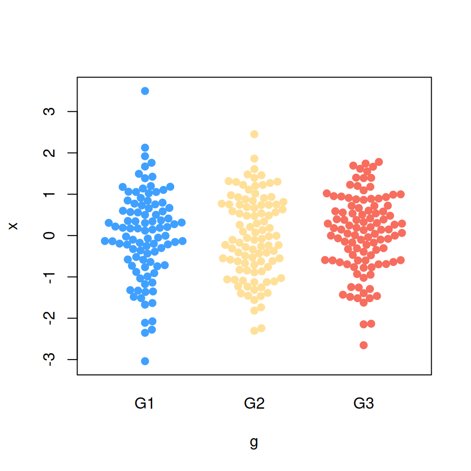
                                                                                                   
Source:&nbsp;&nbsp; <a href=""><strike>Python</strike></a> &nbsp;&nbsp; <a href="src/beeswarm/beeswarm.R">R</a> &nbsp;&nbsp; <a href=""><strike>Julia</strike></a> 
 
    </td>
  </tr>
</tbody>
</table> 
<table class="tg">
<thead>
  <tr>
    <h2>Polars and Ellipses</h2>
  </tr>
</thead>
<tbody>
  <tr>
    <td class="tg-0pky">
       <h4>Polar Heatmap</h4>
       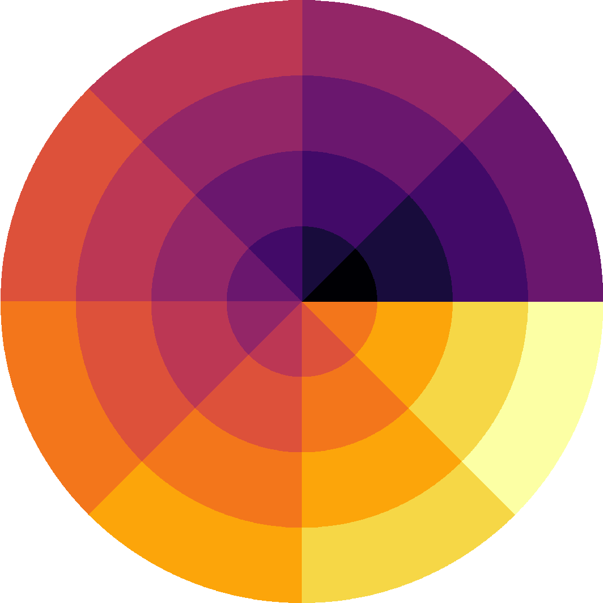
                                                                                                   
Source:&nbsp;&nbsp; <a href=""><strike>Python</strike></a> &nbsp;&nbsp; <a href=""><strike>R</strike></a> &nbsp;&nbsp; <a href="src/heatmaps/polarheatmaps.jl">Julia</a> 
 
    </td>
     <td class="tg-0pky">
       <h4>Polar plot</h4>
       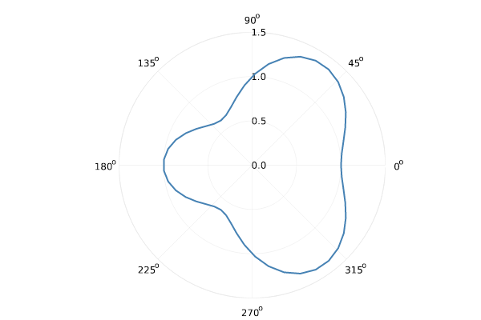
                                                                                                   
Source:&nbsp;&nbsp; <a href=""><strike>Python</strike></a> &nbsp;&nbsp; <a href=""><strike>R</strike></a> &nbsp;&nbsp; <a href="src/polarplots/polar.jl">Julia</a> 
 
    </td>
    <td class="tg-0pky">
       <h4>Polar markers</h4>
       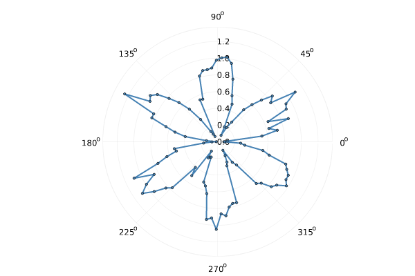
                                                                                                   
Source:&nbsp;&nbsp; <a href=""><strike>Python</strike></a> &nbsp;&nbsp; <a href=""><strike>R</strike></a> &nbsp;&nbsp; <a href="src/polarplots/polar.jl">Julia</a> 
 
    </td>
     <td class="tg-0pky">
       <h4>Rose</h4>
       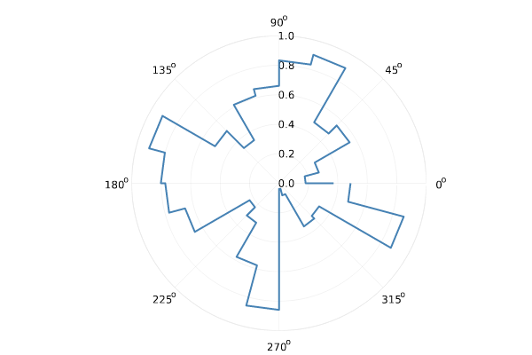
                                                                                                   
Source:&nbsp;&nbsp; <a href=""><strike>Python</strike></a> &nbsp;&nbsp; <a href=""><strike>R</strike></a> &nbsp;&nbsp; <a href="src/polarplots/rose.jl">Julia</a> 
 
    </td>
  </tr>
  <tr>
   <td class="tg-0pky">
       <h4>Wind Rose</h4>
       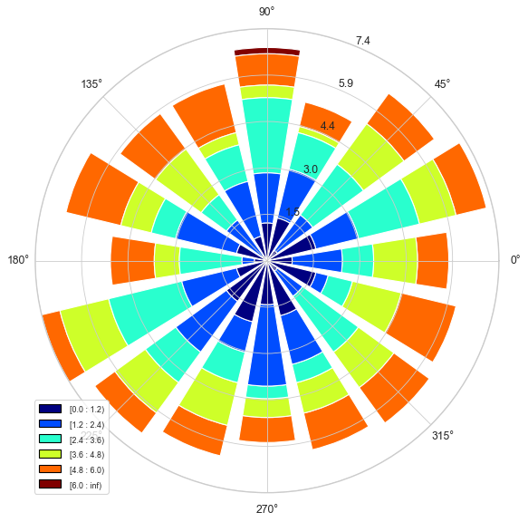
                                                                                                   
Source:&nbsp;&nbsp; <a href="src/polarplots/windrose.py">Python</a> &nbsp;&nbsp; <a href="src/polarplots/windrose.R">R</a> &nbsp;&nbsp; <a href=""><strike>Julia</strike></a> 
 
    </td>
    <td class="tg-0pky">
       <h4>Polar bars</h4>
       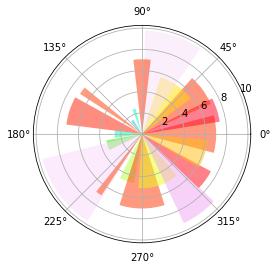
                                                                                                   
Source:&nbsp;&nbsp; <a href="src/polarplots/polarbars.py">Python</a> &nbsp;&nbsp; <a href="">R</a> &nbsp;&nbsp; <a href=""><strike>Julia</strike></a> 
 
    </td>
    <td class="tg-0pky">
       <h4>Polar Histogram</h4>
       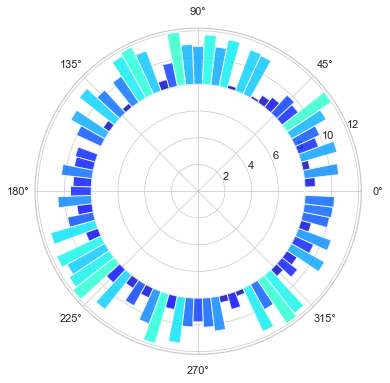
                                                                                                   
Source:&nbsp;&nbsp; <a href="src/polarplots/polarhist.py">Python</a> &nbsp;&nbsp; <a href="">R</a> &nbsp;&nbsp; <a href=""><strike>Julia</strike></a> 
 
    </td>
    <td class="tg-0pky">
       <h4>Polar Lines</h4>
       
                                                                                                   
Source:&nbsp;&nbsp; <a href="src/polarplots/polarlines.py">Python</a> &nbsp;&nbsp; <a href="src/polarplots/linepolar.R">R</a> &nbsp;&nbsp; <a href=""><strike>Julia</strike></a> 
 
    </td>
  </tr>
  <tr>
    <td class="tg-0pky">
       <h4>Concentric Plot</h4>
       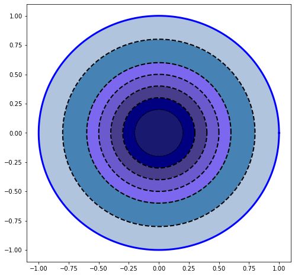
                                                                                                   
Source:&nbsp;&nbsp; <a href="src/polarplots/concentric_plot.py">Python</a> &nbsp;&nbsp; <a href=""><strike>R</strike></a> &nbsp;&nbsp; <a href=""><strike>Julia</strike></a> 
 
    </td>
    <td class="tg-0pky">
       <h4>Sunburst</h4>
       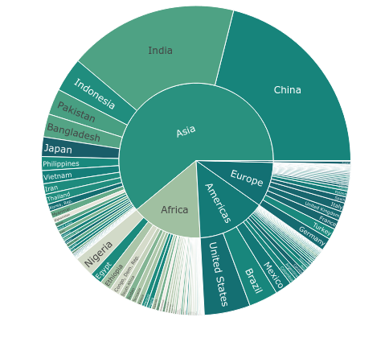
                                                                                                   
Source:&nbsp;&nbsp; <a href="src/polarplots/sunburst.py">Python</a> &nbsp;&nbsp; <a href=""><strike>R</strike></a> &nbsp;&nbsp; <a href=""><strike>Julia</strike></a> 
 
    </td>
    <td class="tg-0pky">
       <h4>Ellipse collection</h4>
       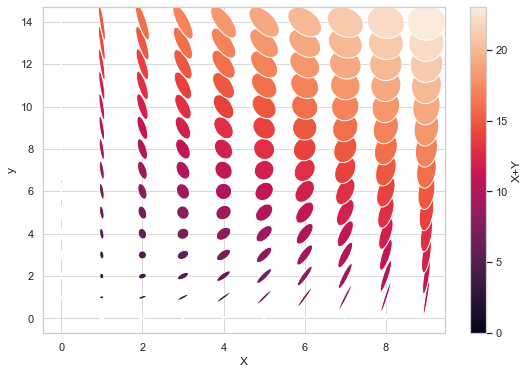
                                                                                                   
Source:&nbsp;&nbsp; <a href="src/ellipses/ellipse_collection.py">Python</a> &nbsp;&nbsp; <a href=""><strike>R</strike></a> &nbsp;&nbsp; <a href=""><strike>Julia</strike></a> 
 
    </td>
    <td class="tg-0pky">
       <h4>Circle strokes</h4>
       
                                                                                                   
Source:&nbsp;&nbsp; <a href=""><strike>Python</strike></a> &nbsp;&nbsp; <a href=""><strike>R</strike></a> &nbsp;&nbsp; <a href="src/ellipses/ellipses.jl">Julia</a> 
 
    </td>
  </tr>
  <tr>
    <td class="tg-0pky">
       <h4>Overlapping ellipses</h4>
       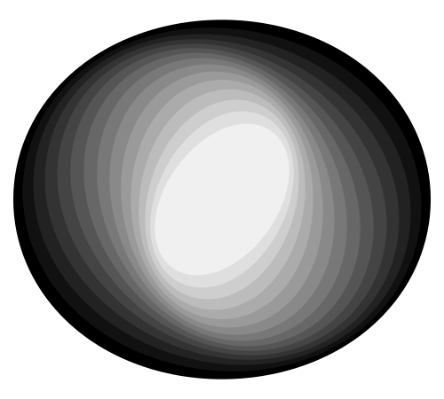
                                                                                                   
Source:&nbsp;&nbsp; <a href=""><strike>Python</strike></a> &nbsp;&nbsp; <a href=""><strike>R</strike></a> &nbsp;&nbsp; <a href="src/ellipses/ellipses.jl">Julia</a> 
 
    </td>
    <td class="tg-0pky">
       <h4>Ellipses radii</h4>
       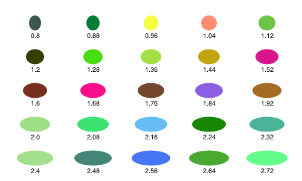
                                                                                                   
Source:&nbsp;&nbsp; <a href=""><strike>Python</strike></a> &nbsp;&nbsp; <a href=""><strike>R</strike></a> &nbsp;&nbsp; <a href="src/ellipses/ellipses.jl">Julia</a> 
 
    </td>
    <td class="tg-0pky">
       <h4>Radial Plot</h4>
       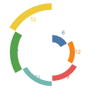
                                                                                                   
Source:&nbsp;&nbsp; <a href=""><strike>Python</strike></a> &nbsp;&nbsp; <a href=""><strike>R</strike></a> &nbsp;&nbsp; <a href="src/radial-plots/radial.jl">Julia</a> 
 
    </td>
    <td class="tg-0pky">
       <h4>Venn Diagram</h4>
       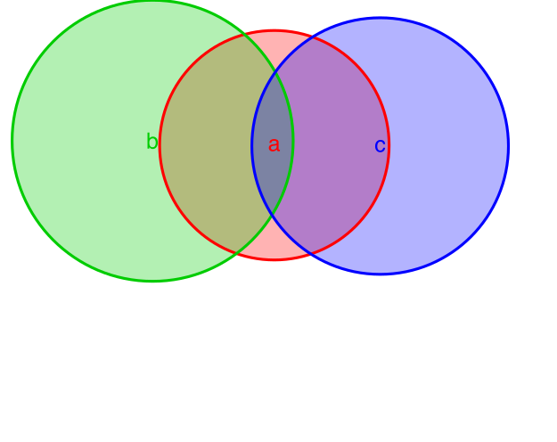
                                                                                                   
Source:&nbsp;&nbsp; <a href="src/venn-diagrams/venn.py">Python</a> &nbsp;&nbsp; <a href=""><strike>R</strike></a> &nbsp;&nbsp; <a href="src/venn-diagrams/venn.jl">Julia</a> 
 
    </td>
  </tr>
  <tr>
    <td class="tg-0pky">
       <h4>Pie chart</h4>
       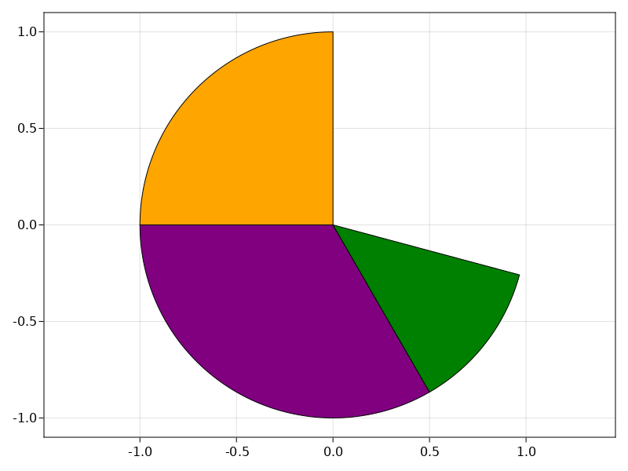
                                                                                                   
Source:&nbsp;&nbsp; <a href="src/pie/piecharts.py">Python</a> &nbsp;&nbsp; <a href="src/pie/pie.R">R</a> &nbsp;&nbsp; <a href="src/pie/piecharts.jl">Julia</a> 
 
    </td>
    <td class="tg-0pky">
       <h4>Donut chart</h4>
       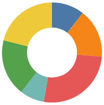
                                                                                                   
Source:&nbsp;&nbsp; <a href=""><strike>Python</strike></a> &nbsp;&nbsp; <a href="src/pie/donut.R">R</a> &nbsp;&nbsp; <a href="src/pie/donut_chart.jl">Julia</a> 
 
    </td>
  </tr>
</tbody>
</table> 
<table class="tg">
<thead>
  <tr>
    <h2>Bars and Magnitude</h2>
  </tr>
</thead>
<tbody>
  <tr>
    <td class="tg-0pky">
       <h4>Bar plot</h4>
       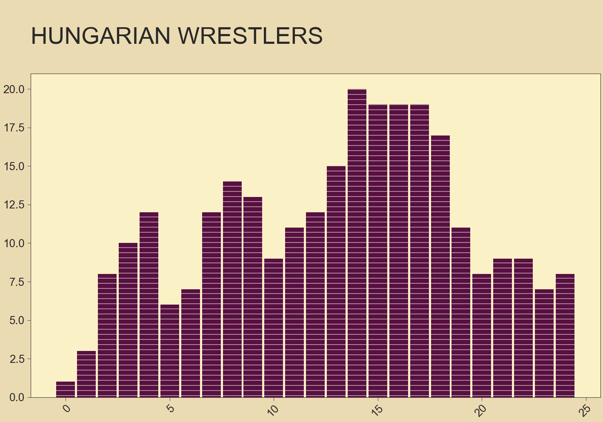
                                                                                                   
Source:&nbsp;&nbsp; <a href="src/bar-charts/bars.py">Python</a> &nbsp;&nbsp; <a href="src/bar-charts/bar.R">R</a> &nbsp;&nbsp; <a href="src/bar-charts/bars.jl">Julia</a> 
 
    </td>
     <td class="tg-0pky">
       <h4>Horizontal Bars</h4>
       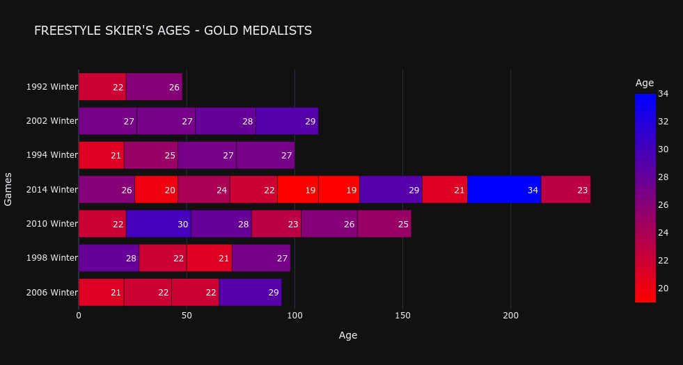
                                                                                                    
Source:&nbsp;&nbsp; <a href="src/bar-charts/bars.py">Python</a> &nbsp;&nbsp; <a href="src/bar-charts/bar.R">R</a> &nbsp;&nbsp; <a href="src/bar-charts/bars.jl">Julia</a> 
 
    </td>
    <td class="tg-0pky">
       <h4>Grouped bars</h4>
       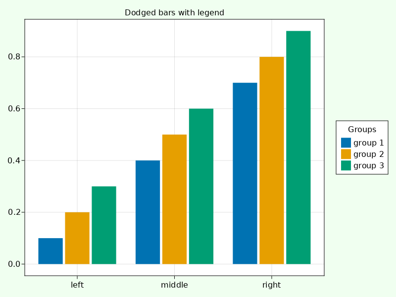
                                                                                                  
Source:&nbsp;&nbsp; <a href="src/bar-charts/bars.py">Python</a> &nbsp;&nbsp; <a href="src/bar-charts/bar.R">R</a> &nbsp;&nbsp; <a href="src/bar-charts/bars.jl">Julia</a> 
 
    </td>
     <td class="tg-0pky">
       <h4>Horizontal Grouped bars</h4>
       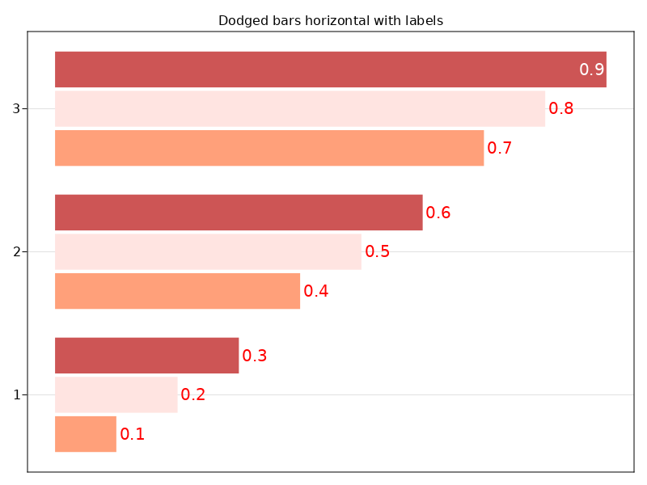
                                                                                                   
Source:&nbsp;&nbsp; <a href="src/bar-charts/bars.py">Python</a> &nbsp;&nbsp; <a href="src/bar-charts/bar.R">R</a> &nbsp;&nbsp; <a href="src/bar-charts/bars.jl">Julia</a> 
 
    </td>
  </tr>
  <tr>
   <td class="tg-0pky">
       <h4>Stacked bars</h4>
       
                                                                                                   
Source:&nbsp;&nbsp; <a href="src/bar-charts/stacked_bar.py">Python</a> &nbsp;&nbsp; <a href="src/bar-charts/bar.R">R</a> &nbsp;&nbsp; <a href="src/bar-charts/bars.jl">Julia</a> 
  
    </td>
    <td class="tg-0pky">
       <h4>Sin bars</h4>
       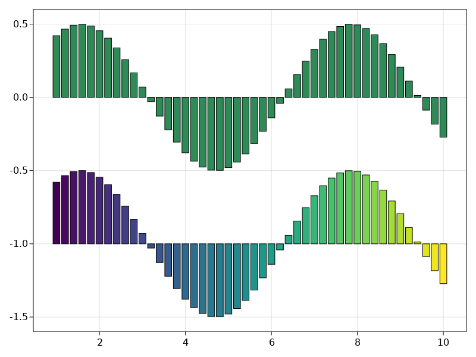
                                                                                                   
Source:&nbsp;&nbsp; <a href=""><strike>Python</strike></a> &nbsp;&nbsp; <a href=""><strike>R</strike></a> &nbsp;&nbsp; <a href="src/bar-charts/sinbars.jl">Julia</a> 
 
    </td>
    <td class="tg-0pky">
       <h4>Population Pyramid</h4>
       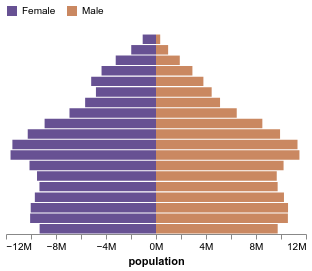
                                                                                                   
Source:&nbsp;&nbsp; <a href="src/pyramids/pop_pyramid.py">Python</a> &nbsp;&nbsp; <a href=""><strike>R</strike></a> &nbsp;&nbsp; <a href="src/pyramids/pop_pyramid.jl">Julia</a> 
 
    </td>
     <td class="tg-0pky">
       <h4>Error bars</h4>
       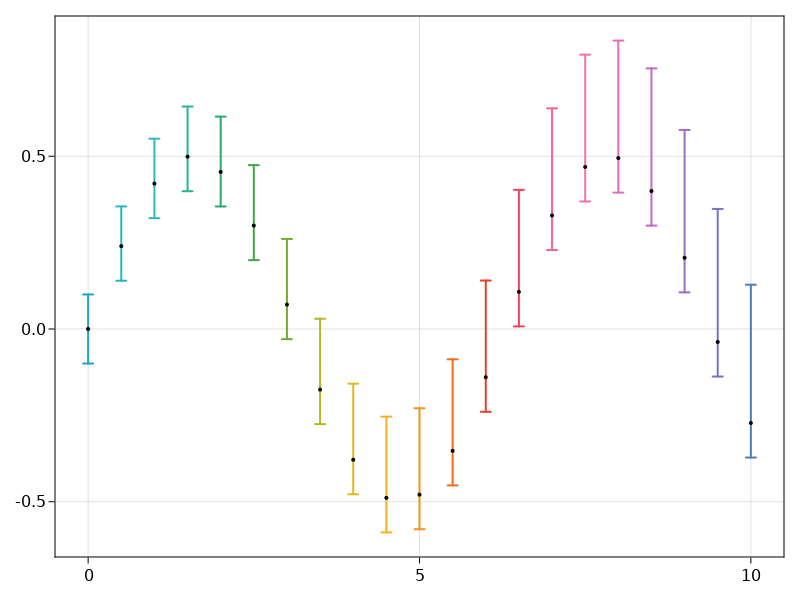
                                                                                                   
Source:&nbsp;&nbsp; <a href=""><strike>Python</strike></a> &nbsp;&nbsp; <a href=""><strike>R</strike></a> &nbsp;&nbsp; <a href="src/errorbars/errorbars.jl">Julia</a> 
 
    </td>
  </tr>
  <tr>
  <td class="tg-0pky">
       <h4>Gantt chart</h4>
       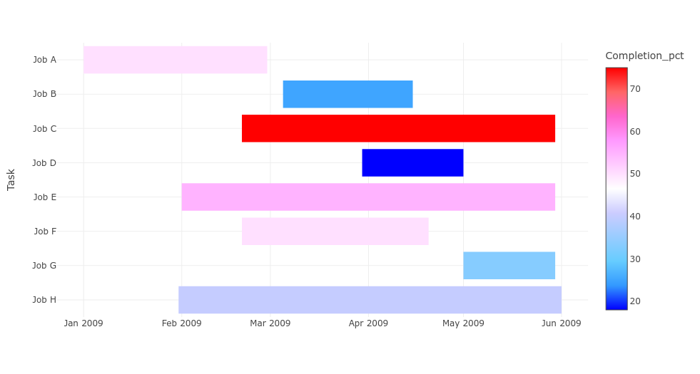
                                                                                                   
Source:&nbsp;&nbsp; <a href="src/gantt/ganttchart.py">Python</a> &nbsp;&nbsp; <a href="src/gantt/gantt.R">R</a> &nbsp;&nbsp; <a href="src/gantt/ganttchart.jl">Julia</a> 
 
    </td>
    </tr>
</tbody>
</table> 
<table class="tg">
<thead>
  <tr>
    <h2>Areas and Distribution</h2>
  </tr>
</thead>
<tbody>
  <tr>
    <td class="tg-0pky">
       <h4>Stacked Area plot</h4>
       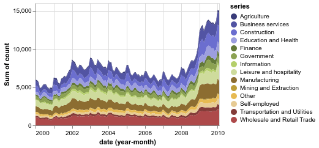
                                                                                                   
Source:&nbsp;&nbsp; <a href="src/area-charts/stackedarea.py">Python</a> &nbsp;&nbsp; <a href="src/area-charts/area.R">R</a> &nbsp;&nbsp; <a href="src/area-charts/stacked_area.jl">Julia</a> 
 
    </td>
        <td class="tg-0pky">
       <h4>Normalized Stacked Area plot</h4>
       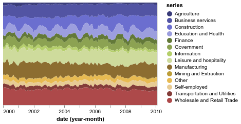
                                                                                                   
Source:&nbsp;&nbsp; <a href=""><strike>Python</strike></a> &nbsp;&nbsp; <a href=""><strike>R</strike></a> &nbsp;&nbsp; <a href="src/area-charts/normalized_stacked_area.jl">Julia</a> 
 
    </td>
     <td class="tg-0pky">
       <h4>Portfolio Composition </h4>
       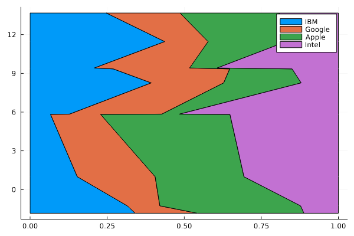
                                                                                                   
Source:&nbsp;&nbsp; <a href=""><strike>Python</strike></a> &nbsp;&nbsp; <a href=""><strike>R</strike></a> &nbsp;&nbsp; <a href="src/area-charts/portfolio_comp.jl">Julia</a> 
 
    </td>
     <td class="tg-0pky">
       <h4>KDE (Density) Plot</h4>
       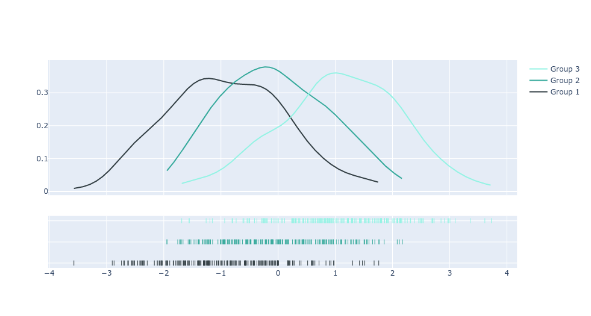
                                                                                                   
Source:&nbsp;&nbsp; <a href="src/density-plots/densityplots.py">Python</a> &nbsp;&nbsp; <a href="src/density-plots/dens.R">R</a> &nbsp;&nbsp; <a href="src/density-plots/kdeplot.jl">Julia</a> 
 
    </td>
  </tr>
  <tr>
   <td class="tg-0pky">
       <h4>Filled KDE plot</h4>
       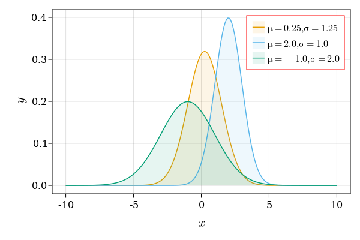
                                                                                                   
Source:&nbsp;&nbsp; <a href="src/density-plots/densityplots.py">Python</a> &nbsp;&nbsp; <a href=""><strike>R</strike></a> &nbsp;&nbsp; <a href="src/density-plots/kdeplot.jl">Julia</a> 
 
    </td>
    <td class="tg-0pky">
       <h4>Stacked KDE plot</h4>
       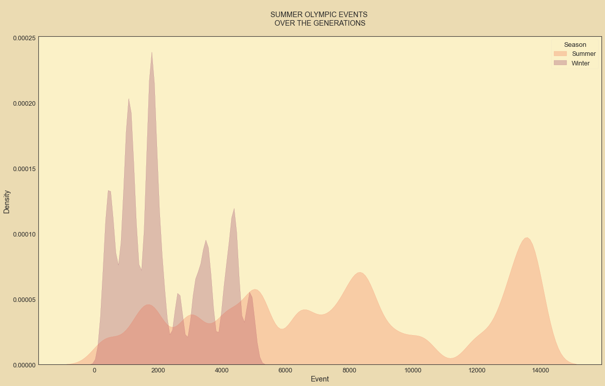
                                                                                                   
Source:&nbsp;&nbsp; <a href="src/density-plots/densityplots.py">Python</a> &nbsp;&nbsp; <a href="">R</a> &nbsp;&nbsp; <a href=""><strike>Julia</strike></a> 
 
    </td>
    <td class="tg-0pky">
       <h4>Frequency Polygon</h4>
       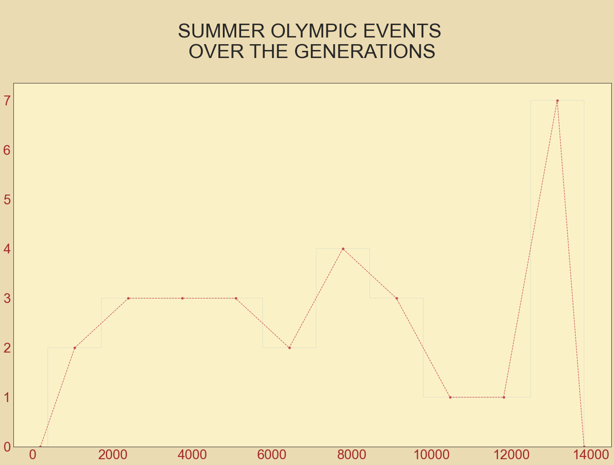
                                                                                                   
Source:&nbsp;&nbsp; <a href="src/freqpoly/freqpoly.py">Python</a> &nbsp;&nbsp; <a href="src/freqpoly/freqpolygon.R">R</a> &nbsp;&nbsp; <a href=""><strike>Julia</strike></a> 
 
    </td>
    <td class="tg-0pky">
       <h4>Histogram</h4>
       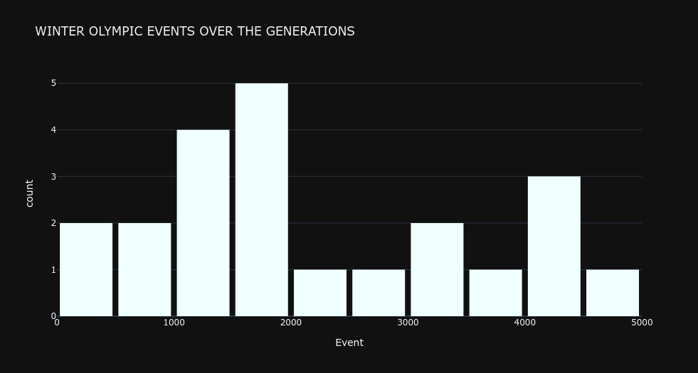
                                                                                                   
Source:&nbsp;&nbsp; <a href="src/histograms/hist.py">Python</a> &nbsp;&nbsp; <a href="src/histograms/histograms.R">R</a> &nbsp;&nbsp; <a href="src/histograms/hist.jl">Julia</a> 
 
    </td>
  </tr>
  <tr>
    <td class="tg-0pky">
       <h4>Histogram + KDE plot</h4>
       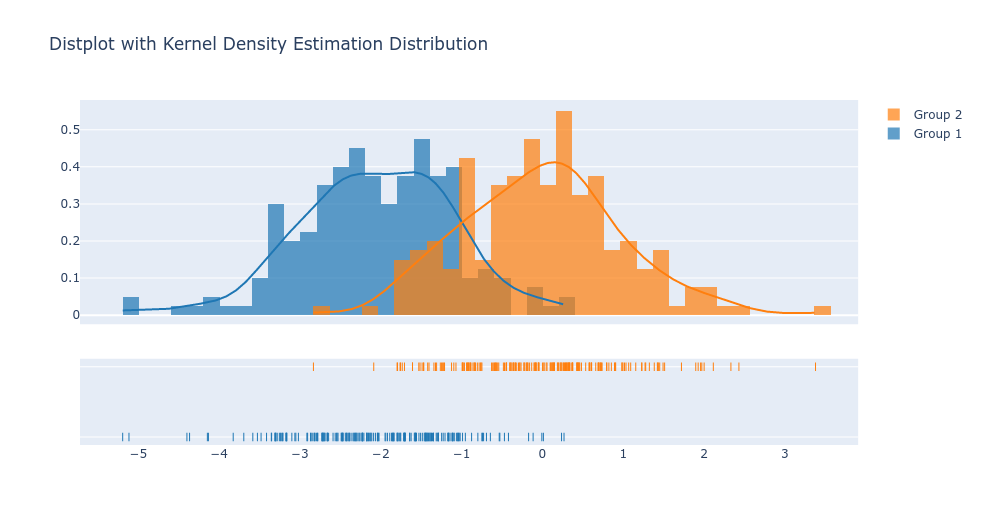
                                                                                                   
Source:&nbsp;&nbsp; <a href="src/histograms/hist.py">Python</a> &nbsp;&nbsp; <a href=""><strike>R</strike></a> &nbsp;&nbsp; <a href=""><strike>Julia</strike></a> 
 
    </td>
    <td class="tg-0pky">
       <h4>Histogram + boxplot</h4>
       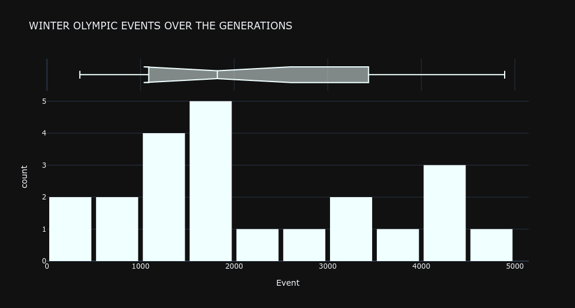
                                                                                                   
Source:&nbsp;&nbsp; <a href="src/histograms/hist.py">Python</a> &nbsp;&nbsp; <a href=""><strike>R</strike></a> &nbsp;&nbsp; <a href=""><strike>Julia</strike></a> 
 
    </td>
    <td class="tg-0pky">
       <h4>Histogram + Violin</h4>
       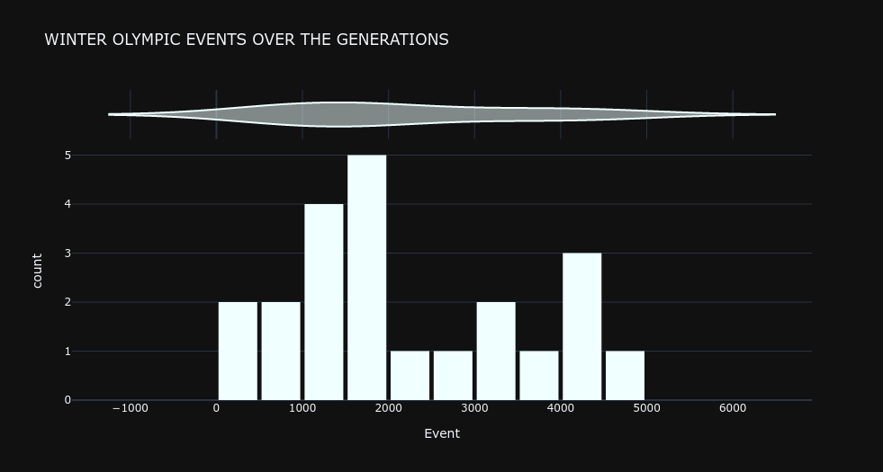
                                                                                                   
Source:&nbsp;&nbsp; <a href="src/histograms/hist.py">Python</a> &nbsp;&nbsp; <a href=""><strike>R</strike></a> &nbsp;&nbsp; <a href=""><strike>Julia</strike></a> 
 
    </td>
    <td class="tg-0pky">
       <h4>Marginal Histogram</h4>
       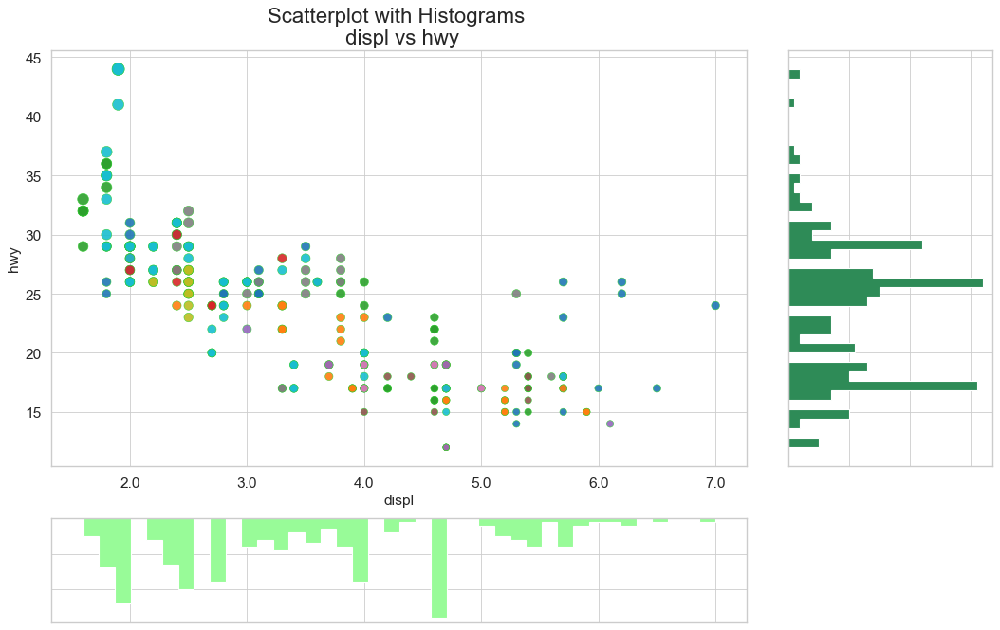
                                                                                                   
Source:&nbsp;&nbsp; <a href="src/histograms/marginal_hist.py">Python</a> &nbsp;&nbsp; <a href=""><strike>R</strike></a> &nbsp;&nbsp; <a href=""><strike>Julia</strike></a> 
 
    </td>
  </tr>
  <tr>
    <td class="tg-0pky">
       <h4>Box plots</h4>
       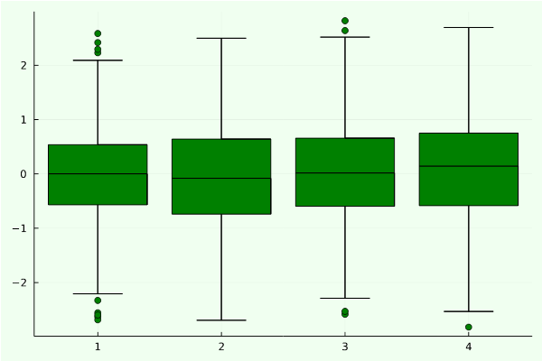
                                                                                                   
Source:&nbsp;&nbsp; <a href="src/boxplots/boxp.py">Python</a> &nbsp;&nbsp; <a href="">R</a> &nbsp;&nbsp; <a href="src/boxplots/boxplot.jl">Julia</a> 
 
    </td>
    <td class="tg-0pky">
       <h4>Notched boxplots</h4>
       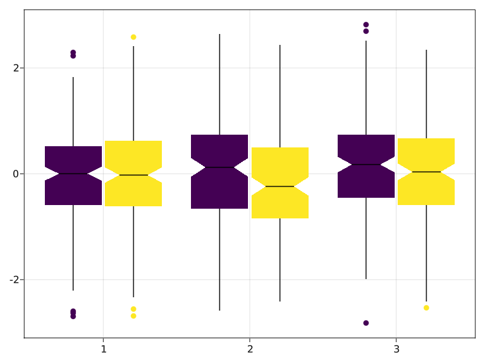
                                                                                                  
Source:&nbsp;&nbsp; <a href="src/boxplots/boxp.py">Python</a> &nbsp;&nbsp; <a href="">R</a> &nbsp;&nbsp; <a href="src/boxplots/boxplot.jl">Julia</a> 
 
    </td>
    <td class="tg-0pky">
       <h4>Normal and Notched boxplots</h4>
       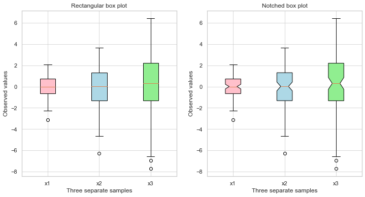
                                                                                                   
Source:&nbsp;&nbsp; <a href="src/boxplots/boxp.py">Python</a> &nbsp;&nbsp; <a href="">R</a> &nbsp;&nbsp; <a href="src/boxplots/boxplot.jl">Julia</a> 
 
    </td>
    <td class="tg-0pky">
       <h4>Marginal Boxplots</h4>
       
                                                                                                   
Source:&nbsp;&nbsp; <a href="src/boxplots/marginal_boxplot.py">Python</a> &nbsp;&nbsp; <a href="">R</a> &nbsp;&nbsp; <a href=""><strike>Julia</strike></a> 
 
    </td>
  </tr>
  <tr>
    <td class="tg-0pky">
       <h4>Violin plot</h4>
       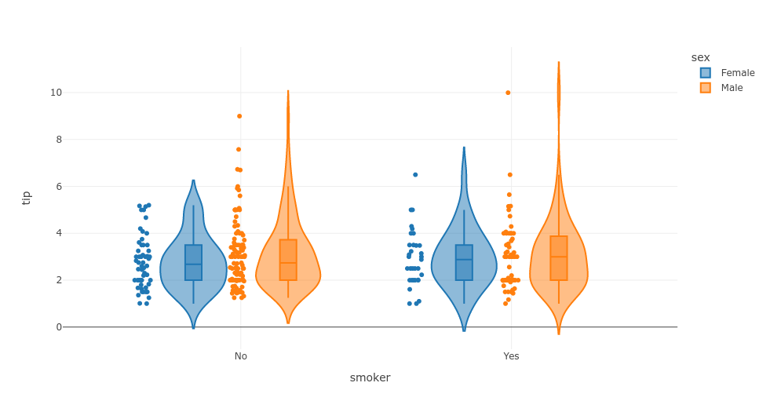
                                                                                                   
Source:&nbsp;&nbsp; <a href="src/violinplots/violin.py">Python</a> &nbsp;&nbsp; <a href="src/violinplots/violinplot.R">R</a> &nbsp;&nbsp; <a href="src/violinplots/violin.jl">Julia</a> 
 
    </td>
    <td class="tg-0pky">
       <h4>Box + Violin plot</h4>
       
                                                                                                   
Source:&nbsp;&nbsp; <a href=""><strike>Python</strike></a> &nbsp;&nbsp; <a href="">R</a> &nbsp;&nbsp; <a href="src/violinplots/box_violin.jl">Julia</a> 
 
    </td>
  </tr>
</tbody>
</table> 
<table class="tg">
<thead>
  <tr>
    <h2>Change over time and Time Series</h2>
  </tr>
</thead>
<tbody>
  <tr>
    <td class="tg-0pky">
       <h4>Time Series</h4>
       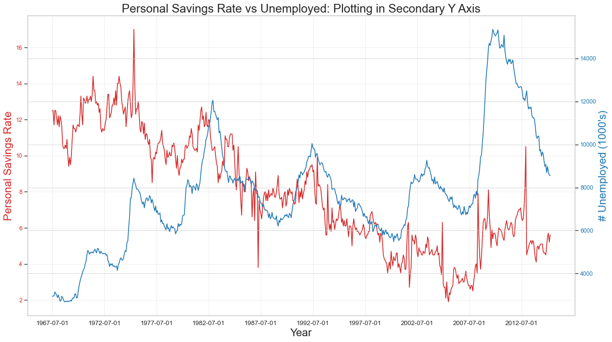
                                                                                                   
Source:&nbsp;&nbsp; <a href="src/timeseries/timeseries.py">Python</a> &nbsp;&nbsp; <a href=""><strike>R</strike></a> &nbsp;&nbsp; <a href="src/timeseries/timeseries.jl">Julia</a> 
 
    </td>
    <td class="tg-0pky">
       <h4>Annotated Time series</h4>
       
                                                                                                   
Source:&nbsp;&nbsp; <a href="src/timeseries/annotated_timeseries.py">Python</a> &nbsp;&nbsp; <a href=""><strike>R</strike></a> &nbsp;&nbsp; <a href=""><strike>Julia</strike></a> 
 
    </td>
    <td class="tg-0pky">
       <h4>Time Series Histogram</h4>
       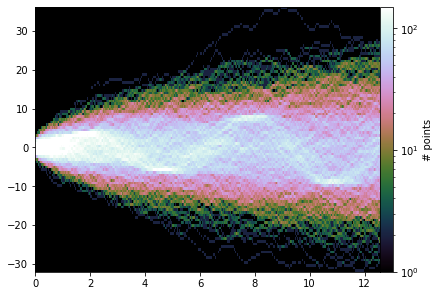
                                                                                                   
Source:&nbsp;&nbsp; <a href="src/timeseries/timeseries_hist.py">Python</a> &nbsp;&nbsp; <a href=""><strike>R</strike></a> &nbsp;&nbsp; <a href=""><strike>Julia</strike></a> 
 
    </td>
    <td class="tg-0pky">
       <h4>Candle Sticks</h4>
       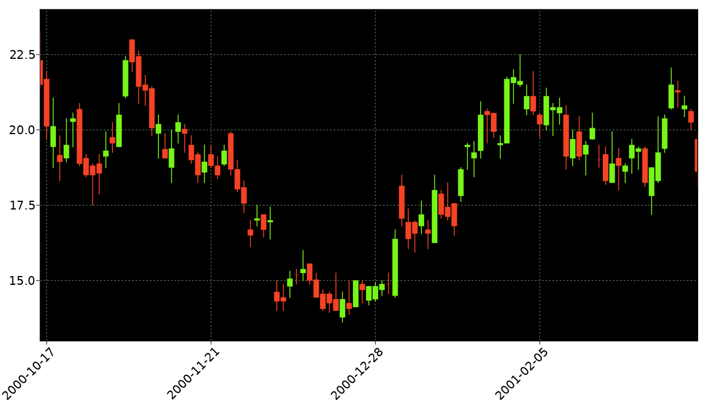
                                                                                                   
Source:&nbsp;&nbsp; <a href=""><strike>Python</strike></a> &nbsp;&nbsp; <a href=""><strike>R</strike></a> &nbsp;&nbsp; <a href="src/timeseries/candlesticks.jl">Julia</a> 
 
    </td>
  </tr>
</tbody>
</table> 
</table> 
<table class="tg">
<thead>
  <tr>
    <h2>Polygons, Spirals and Hyperbolae</h2>
  </tr>
</thead>
<tbody>
  <tr>
    <td class="tg-0pky">
       <h4>Archimedian Spirals</h4>
       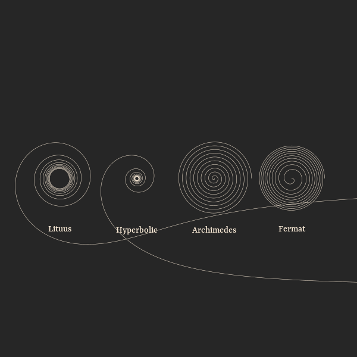
                                                                                                   
Source:&nbsp;&nbsp; <a href=""><strike>Python</strike></a> &nbsp;&nbsp; <a href=""><strike>R</strike></a> &nbsp;&nbsp; <a href="src/polygons/archimedian.jl">Julia</a> 
 
    </td>
    <td class="tg-0pky">
       <h4>Logarithmic Spirals</h4>
       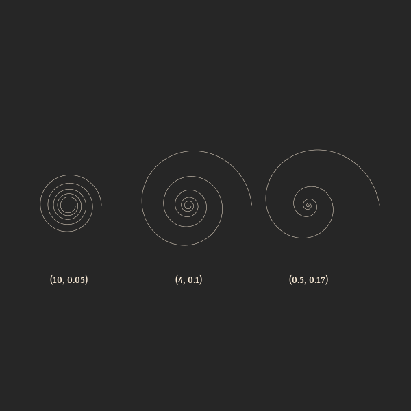
                                                                                                 
Source:&nbsp;&nbsp; <a href=""><strike>Python</strike></a> &nbsp;&nbsp; <a href=""><strike>R</strike></a> &nbsp;&nbsp; <a href="src/polygons/logarithmic.jl">Julia</a> 
 
    </td>
    <td class="tg-0pky">
       <h4>Hypotrochoid</h4>
       
                                                                                                 
Source:&nbsp;&nbsp; <a href=""><strike>Python</strike></a> &nbsp;&nbsp; <a href=""><strike>R</strike></a> &nbsp;&nbsp; <a href="src/polygons/hypotrochoid.jl">Julia</a> 
 
    </td>
    <td class="tg-0pky">
       <h4>Koch Snowflake</h4>
       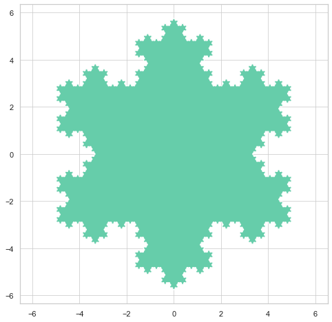
                                                                                                   
Source:&nbsp;&nbsp; <a href="src/polygons/koch_snowflake.py">Python</a> &nbsp;&nbsp; <a href=""><strike>R</strike></a> &nbsp;&nbsp; <a href=""><strike>Julia</strike></a> 
 
    </td>
  </tr>
   <tr>
    <td class="tg-0pky">
       <h4>Circular N-gons</h4>
       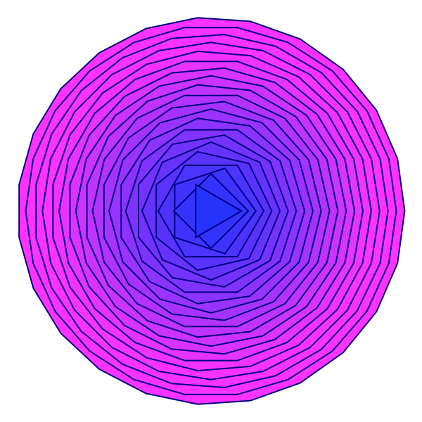
                                                                                                   
Source:&nbsp;&nbsp; <a href=""><strike>Python</strike></a> &nbsp;&nbsp; <a href=""><strike>R</strike></a> &nbsp;&nbsp; <a href="src/polygons/ngons_circular.jl">Julia</a> 
 
    </td>
    <td class="tg-0pky">
       <h4>Triangular N-gons</h4>
       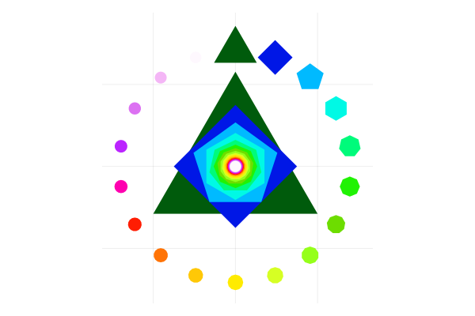
                                                                                                 
Source:&nbsp;&nbsp; <a href=""><strike>Python</strike></a> &nbsp;&nbsp; <a href=""><strike>R</strike></a> &nbsp;&nbsp; <a href="src/polygons/ngons_triangular.jl">Julia</a> 
 
    </td>
    <td class="tg-0pky">
       <h4>Random-N-gons</h4>
       
                                                                                                 
Source:&nbsp;&nbsp; <a href=""><strike>Python</strike></a> &nbsp;&nbsp; <a href=""><strike>R</strike></a> &nbsp;&nbsp; <a href="src/polygons/rand_ngons.jl">Julia</a> 
 
    </td>
    <td class="tg-0pky">
       <h4>Offsetting Polygons</h4>
       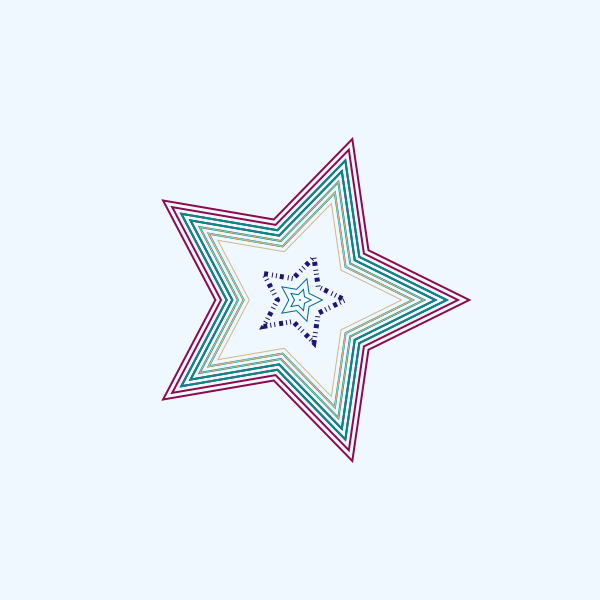
                                                                                                   
Source:&nbsp;&nbsp; <a href=""><strike>Python</strike></a> &nbsp;&nbsp; <a href=""><strike>R</strike></a> &nbsp;&nbsp; <a href="src/polygons/offsetting_polygons.jl">Julia</a> 
 
    </td>
  </tr>
   <tr>
    <td class="tg-0pky">
       <h4>Smoothing Polygons</h4>
       
                                                                                                   
Source:&nbsp;&nbsp; <a href=""><strike>Python</strike></a> &nbsp;&nbsp; <a href=""><strike>R</strike></a> &nbsp;&nbsp; <a href="src/polygons/smoothing_polygons.jl">Julia</a> 
 
    </td>
    <td class="tg-0pky">
       <h4>Spirograph</h4>
       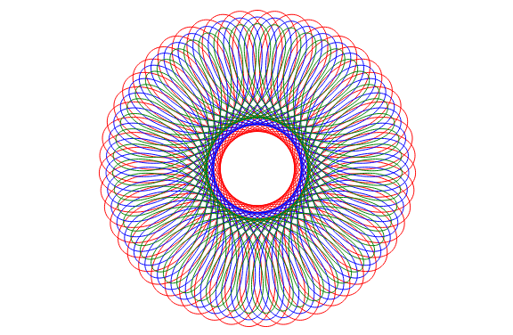
                                                                                                 
Source:&nbsp;&nbsp; <a href=""><strike>Python</strike></a> &nbsp;&nbsp; <a href=""><strike>R</strike></a> &nbsp;&nbsp; <a href="src/spirograph/spiro.jl">Julia</a> 
 
    </td>
    <td class="tg-0pky">
       <h4>Hyperbolic Pencil</h4>
       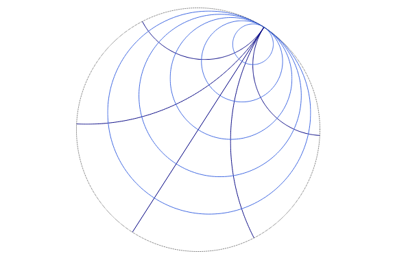
                                                                                                 
Source:&nbsp;&nbsp; <a href=""><strike>Python</strike></a> &nbsp;&nbsp; <a href=""><strike>R</strike></a> &nbsp;&nbsp; <a href="src/hyperbolae/pencil.jl">Julia</a> 
 
    </td>
    <td class="tg-0pky">
       <h4>Hyperbolic Graph</h4>
       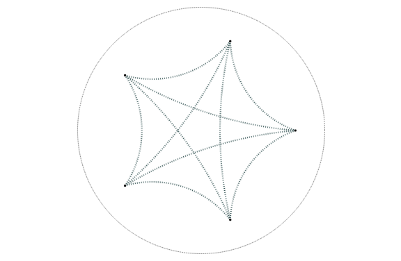
                                                                                                   
Source:&nbsp;&nbsp; <a href=""><strike>Python</strike></a> &nbsp;&nbsp; <a href=""><strike>R</strike></a> &nbsp;&nbsp; <a href="src/hyperbolae/hyperbolic_graph.jl">Julia</a> 
 
    </td>
  </tr>
  <tr>
    <td class="tg-0pky">
       <h4>Star of David</h4>
       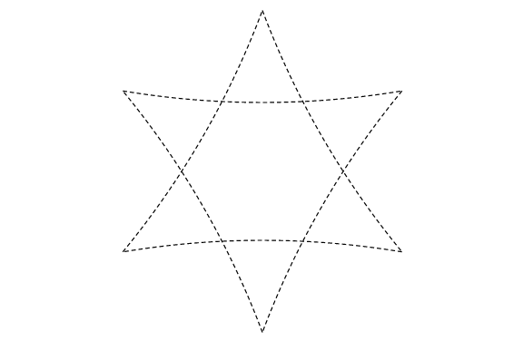
                                                                                                   
Source:&nbsp;&nbsp; <a href=""><strike>Python</strike></a> &nbsp;&nbsp; <a href=""><strike>R</strike></a> &nbsp;&nbsp; <a href="src/hyperbolae/star.jl">Julia</a> 
 
    </td>
    <td class="tg-0pky">
       <h4>Concentric Pattern</h4>
       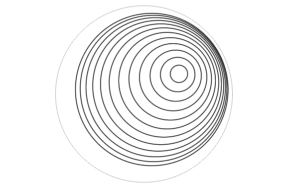
                                                                                                 
Source:&nbsp;&nbsp; <a href=""><strike>Python</strike></a> &nbsp;&nbsp; <a href=""><strike>R</strike></a> &nbsp;&nbsp; <a href="src/hyperbolae/hyperbolic_circles.jl">Julia</a> 
 
    </td>
    <td class="tg-0pky">
       <h4>Dual Tesselation</h4>
       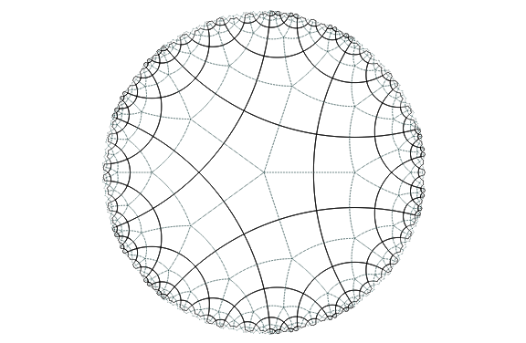
                                                                                                 
Source:&nbsp;&nbsp; <a href=""><strike>Python</strike></a> &nbsp;&nbsp; <a href=""><strike>R</strike></a> &nbsp;&nbsp; <a href="src/hyperbolae/dual_tess.jl">Julia</a> 
 
    </td>
  </tr>
</tbody>
</table> 
 
<table class="tg">
<thead>
  <tr>
    <h2>Contours and Topography</h2>
  </tr>
</thead>
<tbody>
  <tr>
    <td class="tg-0pky">
       <h4>Contour plot</h4>
       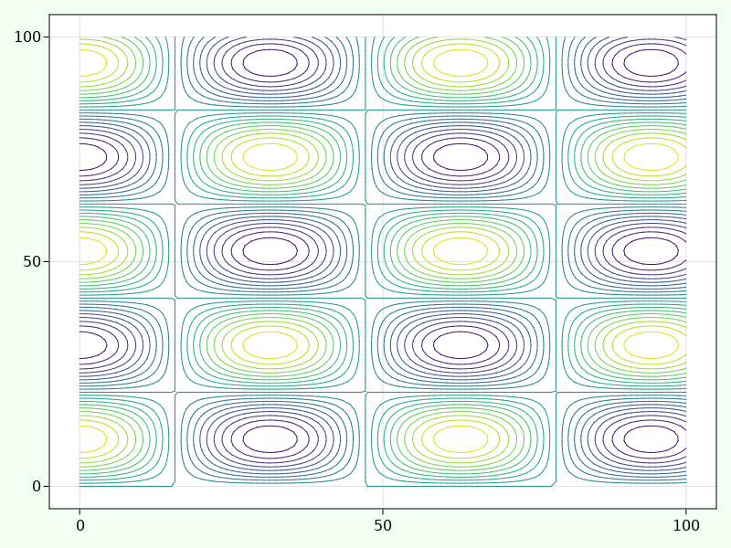
                                                                                                   
Source:&nbsp;&nbsp; <a href="src/contours/contours.py">Python</a> &nbsp;&nbsp; <a href=""><strike>R</strike></a> &nbsp;&nbsp; <a href="src/contours/contours.jl">Julia</a> 
 
    </td>
    <td class="tg-0pky">
       <h4>Filled Contours</h4>
       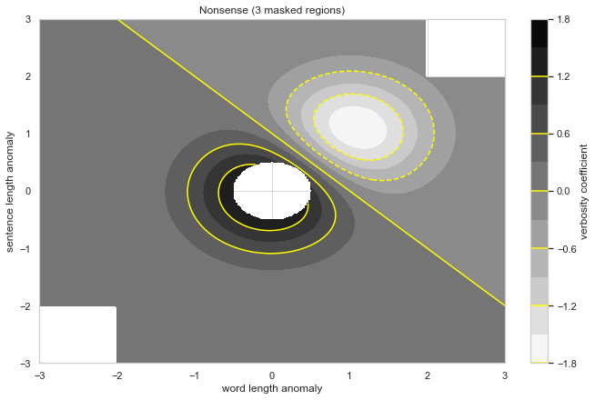
                                                                                                 
Source:&nbsp;&nbsp; <a href="src/contours/contourf.py">Python</a> &nbsp;&nbsp; <a href=""><strike>R</strike></a> &nbsp;&nbsp; <a href="src/contours/contourf.jl">Julia</a> 
 
    </td>
    <td class="tg-0pky">
       <h4>Contour heatmap</h4>
       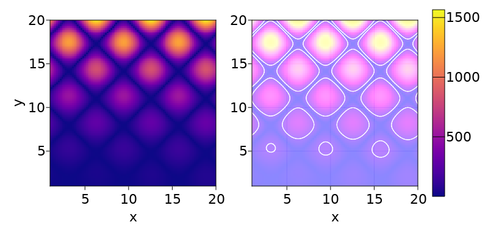
                                                                                                 
Source:&nbsp;&nbsp; <a href=""><strike>Python</strike></a> &nbsp;&nbsp; <a href=""><strike>R</strike></a> &nbsp;&nbsp; <a href="src/contours/contour_heatmap.jl">Julia</a> 
 
    </td>
    <td class="tg-0pky">
       <h4>Contour qubit</h4>
       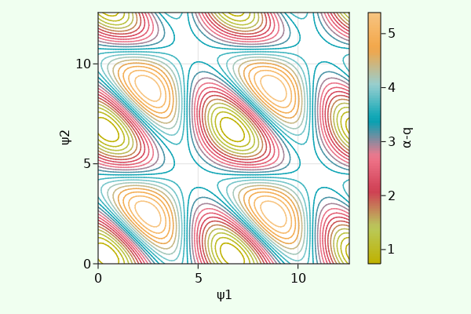
                                                                                                   
Source:&nbsp;&nbsp; <a href=""><strike>Python</strike></a> &nbsp;&nbsp; <a href=""><strike>R</strike></a> &nbsp;&nbsp; <a href="src/contours/contour_qubit.jl">Julia</a> 
 
    </td>
  </tr>
   <tr>
    <td class="tg-0pky">
       <h4>World Countries</h4>
       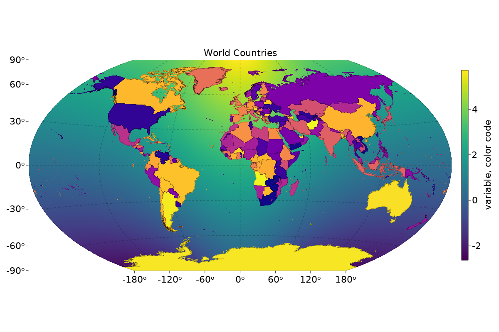
                                                                                                   
Source:&nbsp;&nbsp; <a href=""><strike>Python</strike></a> &nbsp;&nbsp; <a href=""><strike>R</strike></a> &nbsp;&nbsp; <a href="src/geo-field-countries/countries.jl">Julia</a> 
 
    </td>
    <td class="tg-0pky">
       <h4>World Population Estimation</h4>
       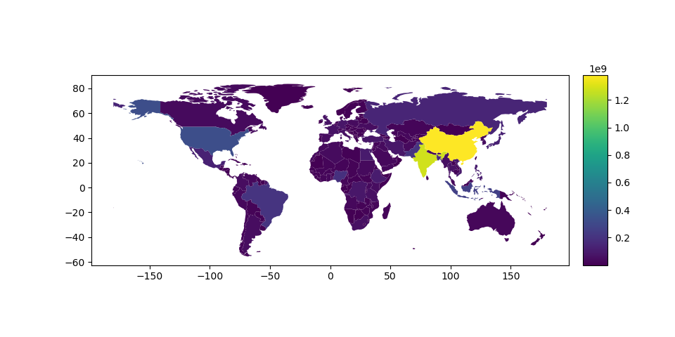
                                                                                                 
Source:&nbsp;&nbsp; <a href="src/geo-field-countries/countries_pop.py">Python</a> &nbsp;&nbsp; <a href=""><strike>R</strike></a> &nbsp;&nbsp; <a href=""><strike>Julia</strike></a> 
 
    </td>
    <td class="tg-0pky">
       <h4>London Tube Lines</h4>
       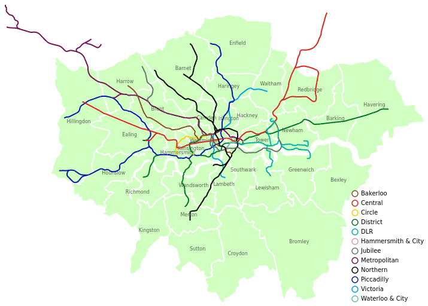
                                                                                                 
Source:&nbsp;&nbsp; <a href=""><strike>Python</strike></a> &nbsp;&nbsp; <a href=""><strike>R</strike></a> &nbsp;&nbsp; <a href="src/london-tube-lines/london_tubes.jl">Julia</a> 
 
    </td>
    <td class="tg-0pky">
       <h4>Submarine cables</h4>
       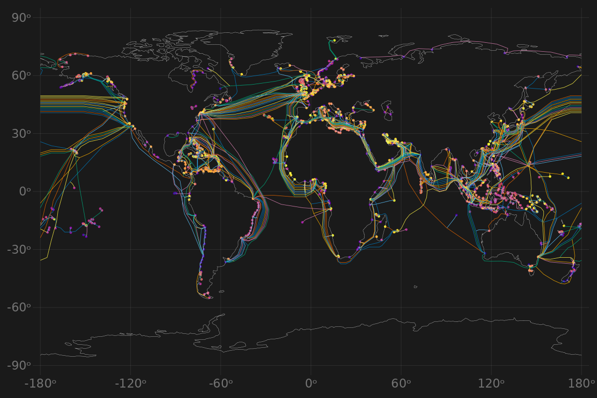
                                                                                                   
Source:&nbsp;&nbsp; <a href=""><strike>Python</strike></a> &nbsp;&nbsp; <a href=""><strike>R</strike></a> &nbsp;&nbsp; <a href="src/submarine-cables/sub-cables.jl">Julia</a> 
 
    </td>
  </tr>
  <tr>
    <td class="tg-0pky">
       <h4>Proj4 to Sphere</h4>
       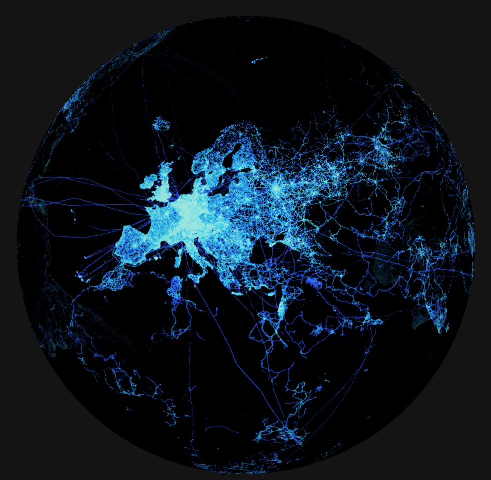
                                                                                                   
Source:&nbsp;&nbsp; <a href=""><strike>Python</strike></a> &nbsp;&nbsp; <a href=""><strike>R</strike></a> &nbsp;&nbsp; <a href="src/sphere/proj4tosphere.jl">Julia</a> 
 
    </td>
    <td class="tg-0pky">
       <h4>Lambert Projection</h4>
       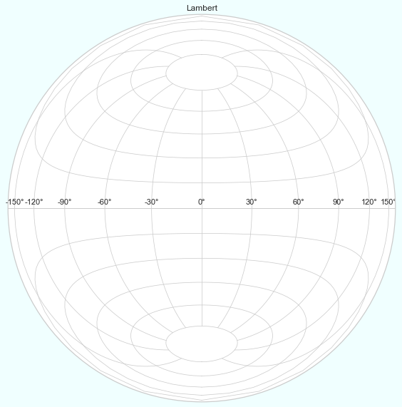
                                                                                                 
Source:&nbsp;&nbsp; <a href="src/sphere/geog_proj.py">Python</a> &nbsp;&nbsp; <a href=""><strike>R</strike></a> &nbsp;&nbsp; <a href=""><strike>Julia</strike></a> 
 
    </td>
    <td class="tg-0pky">
       <h4>Aitoff Projection</h4>
       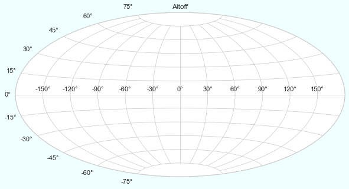
                                                                                                 
Source:&nbsp;&nbsp; <a href="src/sphere/geog_proj.py">Python</a> &nbsp;&nbsp; <a href=""><strike>R</strike></a> &nbsp;&nbsp; <a href=""><strike>Julia</strike></a> 
 
    </td>
    <td class="tg-0pky">
       <h4>Mollweide Projection</h4>
       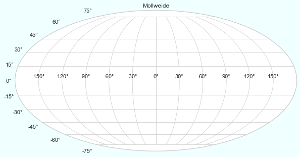
                                                                                                 
Source:&nbsp;&nbsp; <a href="src/sphere/geog_proj.py">Python</a> &nbsp;&nbsp; <a href=""><strike>R</strike></a> &nbsp;&nbsp; <a href=""><strike>Julia</strike></a> 
 
    </td>
    </tr>
</tbody>
</table> 
  </html>
